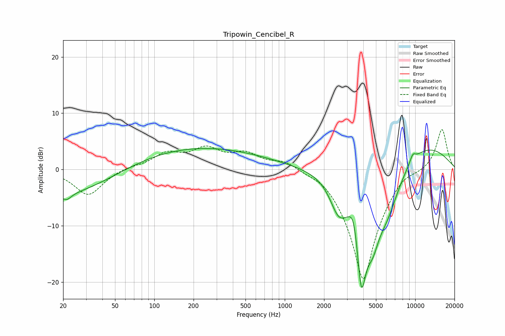

# Tripowin_Cencibel_R
See [usage instructions](https://github.com/jaakkopasanen/AutoEq#usage) for more options and info.

### Parametric EQs
Apply preamp of -3.8 dB when using parametric equalizer.

|   # | Type    |   Fc (Hz) |    Q |   Gain (dB) |
|-----|---------|-----------|------|-------------|
|   1 | Peaking |        20 | 0.3  |        -5.2 |
|   2 | Peaking |        21 | 4.18 |        -1.1 |
|   3 | Peaking |       176 | 0.23 |         4.2 |
|   4 | Peaking |      2576 | 2.19 |        -4.9 |
|   5 | Peaking |      3391 | 3.77 |         5.1 |
|   6 | Peaking |      3861 | 2.67 |       -19.6 |
|   7 | Peaking |      4730 | 3.14 |        -4.1 |
|   8 | Peaking |      5986 | 1.12 |        -9.4 |
|   9 | Peaking |      9572 | 5.59 |         1.3 |
|  10 | Peaking |      9576 | 0.38 |         5.6 |

### Fixed Band EQs
When using fixed band (also called graphic) equalizer, apply preamp of **-7.2 dB** (if available) and set gains manually with these parameters.

|   # | Type    |   Fc (Hz) |    Q |   Gain (dB) |
|-----|---------|-----------|------|-------------|
|   1 | Peaking |        31 | 1.41 |        -4.6 |
|   2 | Peaking |        62 | 1.41 |         0.5 |
|   3 | Peaking |       125 | 1.41 |         2.6 |
|   4 | Peaking |       250 | 1.41 |         3.3 |
|   5 | Peaking |       500 | 1.41 |         2.5 |
|   6 | Peaking |      1000 | 1.41 |         1.7 |
|   7 | Peaking |      2000 | 1.41 |         1.2 |
|   8 | Peaking |      4000 | 1.41 |       -20   |
|   9 | Peaking |      8000 | 1.41 |         1.5 |
|  10 | Peaking |     16000 | 1.41 |         7.4 |

### Graphs

