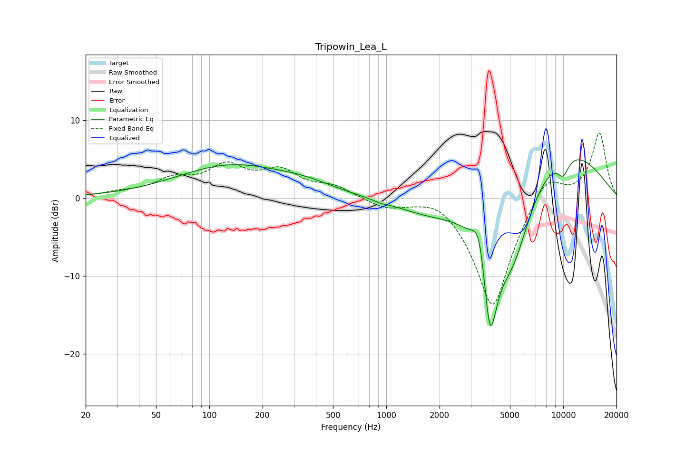

# Tripowin_Lea_L
See [usage instructions](https://github.com/jaakkopasanen/AutoEq#usage) for more options and info.

### Parametric EQs
Apply preamp of -5.0 dB when using parametric equalizer.

|   # | Type    |   Fc (Hz) |    Q |   Gain (dB) |
|-----|---------|-----------|------|-------------|
|   1 | Peaking |       132 | 0.46 |         4.1 |
|   2 | Peaking |       302 | 4.93 |         0   |
|   3 | Peaking |       351 | 0.84 |         1   |
|   4 | Peaking |       932 | 4.14 |        -0.2 |
|   5 | Peaking |      1761 | 0.73 |        -1.9 |
|   6 | Peaking |      3358 | 3.62 |         5.3 |
|   7 | Peaking |      3855 | 2.8  |       -16.2 |
|   8 | Peaking |      5220 | 1.32 |        -8.8 |
|   9 | Peaking |      9549 | 0.46 |         7.1 |
|  10 | Peaking |     10000 | 3.6  |        -2.2 |

### Fixed Band EQs
When using fixed band (also called graphic) equalizer, apply preamp of **-8.4 dB** (if available) and set gains manually with these parameters.

|   # | Type    |   Fc (Hz) |    Q |   Gain (dB) |
|-----|---------|-----------|------|-------------|
|   1 | Peaking |        31 | 1.41 |         0.5 |
|   2 | Peaking |        62 | 1.41 |         2.1 |
|   3 | Peaking |       125 | 1.41 |         3.6 |
|   4 | Peaking |       250 | 1.41 |         3.1 |
|   5 | Peaking |       500 | 1.41 |         1.4 |
|   6 | Peaking |      1000 | 1.41 |        -1.2 |
|   7 | Peaking |      2000 | 1.41 |         1.3 |
|   8 | Peaking |      4000 | 1.41 |       -14.5 |
|   9 | Peaking |      8000 | 1.41 |         3.8 |
|  10 | Peaking |     16000 | 1.41 |         8.4 |

### Graphs

