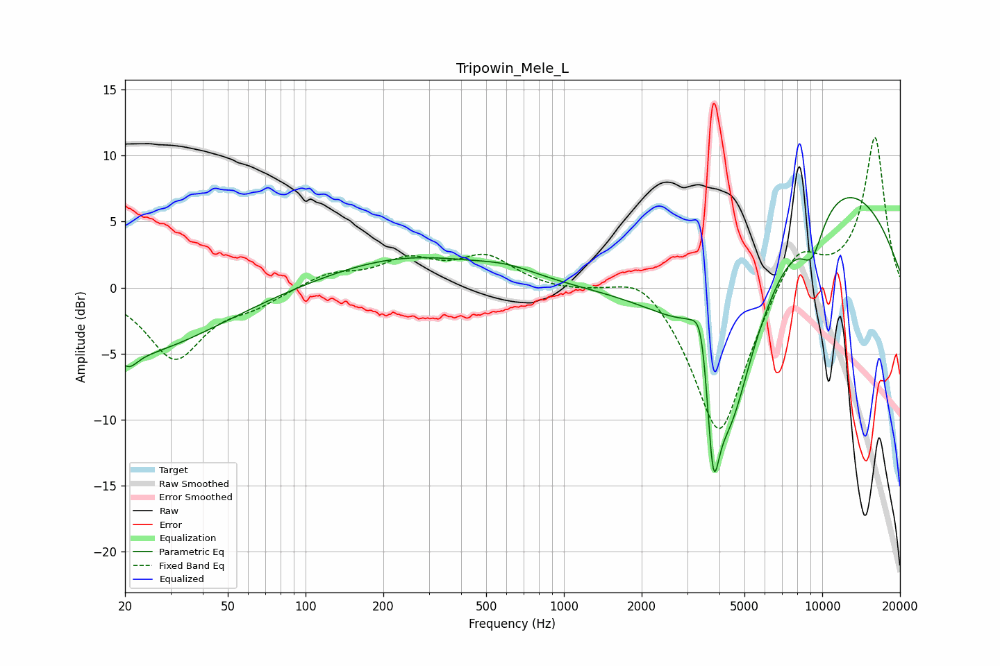

# Tripowin_Mele_L
See [usage instructions](https://github.com/jaakkopasanen/AutoEq#usage) for more options and info.

### Parametric EQs
Apply preamp of -6.9 dB when using parametric equalizer.

|   # | Type    |   Fc (Hz) |    Q |   Gain (dB) |
|-----|---------|-----------|------|-------------|
|   1 | Peaking |        20 | 0.42 |        -5.1 |
|   2 | Peaking |        21 | 4.51 |        -0.9 |
|   3 | Peaking |       249 | 0.45 |         2.4 |
|   4 | Peaking |       607 | 1.22 |         0.6 |
|   5 | Peaking |      3331 | 1.97 |         3.6 |
|   6 | Peaking |      3411 | 5.26 |         3   |
|   7 | Peaking |      3783 | 5.99 |        -8.5 |
|   8 | Peaking |      4323 | 1.06 |       -16.3 |
|   9 | Peaking |      9118 | 2.71 |        -3.3 |
|  10 | Peaking |      9839 | 0.33 |         9.4 |

### Fixed Band EQs
When using fixed band (also called graphic) equalizer, apply preamp of **-11.5 dB** (if available) and set gains manually with these parameters.

|   # | Type    |   Fc (Hz) |    Q |   Gain (dB) |
|-----|---------|-----------|------|-------------|
|   1 | Peaking |        31 | 1.41 |        -5.3 |
|   2 | Peaking |        62 | 1.41 |        -1.1 |
|   3 | Peaking |       125 | 1.41 |         1.1 |
|   4 | Peaking |       250 | 1.41 |         1.9 |
|   5 | Peaking |       500 | 1.41 |         2.2 |
|   6 | Peaking |      1000 | 1.41 |        -0.2 |
|   7 | Peaking |      2000 | 1.41 |         1.8 |
|   8 | Peaking |      4000 | 1.41 |       -11.6 |
|   9 | Peaking |      8000 | 1.41 |         3.6 |
|  10 | Peaking |     16000 | 1.41 |        11.4 |

### Graphs

