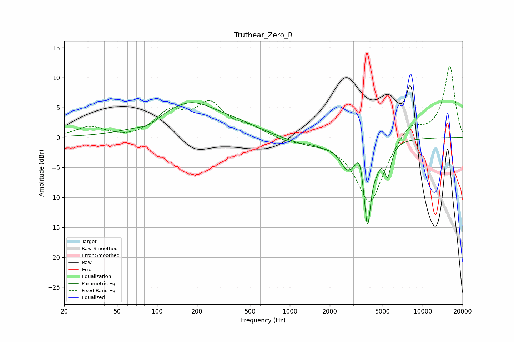

# Truthear_Zero_R
See [usage instructions](https://github.com/jaakkopasanen/AutoEq#usage) for more options and info.

### Parametric EQs
Apply preamp of -5.9 dB when using parametric equalizer.

|   # | Type    |   Fc (Hz) |    Q |   Gain (dB) |
|-----|---------|-----------|------|-------------|
|   1 | Peaking |        86 | 2.05 |        -0.8 |
|   2 | Peaking |       179 | 0.62 |         5.7 |
|   3 | Peaking |       416 | 1.06 |         0.8 |
|   4 | Peaking |       661 | 1.98 |         0.1 |
|   5 | Peaking |      1446 | 0.83 |        -1.3 |
|   6 | Peaking |      2720 | 2.55 |        -3.9 |
|   7 | Peaking |      3357 | 6    |         2.6 |
|   8 | Peaking |      3845 | 4.9  |       -13.6 |
|   9 | Peaking |      4518 | 6    |        -1.2 |
|  10 | Peaking |      5450 | 5.33 |        -5.1 |

### Fixed Band EQs
When using fixed band (also called graphic) equalizer, apply preamp of **-12.1 dB** (if available) and set gains manually with these parameters.

|   # | Type    |   Fc (Hz) |    Q |   Gain (dB) |
|-----|---------|-----------|------|-------------|
|   1 | Peaking |        31 | 1.41 |         1.7 |
|   2 | Peaking |        62 | 1.41 |        -0.3 |
|   3 | Peaking |       125 | 1.41 |         3.9 |
|   4 | Peaking |       250 | 1.41 |         5.2 |
|   5 | Peaking |       500 | 1.41 |         1.3 |
|   6 | Peaking |      1000 | 1.41 |        -0.7 |
|   7 | Peaking |      2000 | 1.41 |        -0.3 |
|   8 | Peaking |      4000 | 1.41 |       -11.2 |
|   9 | Peaking |      8000 | 1.41 |         2.8 |
|  10 | Peaking |     16000 | 1.41 |        12   |

### Graphs

