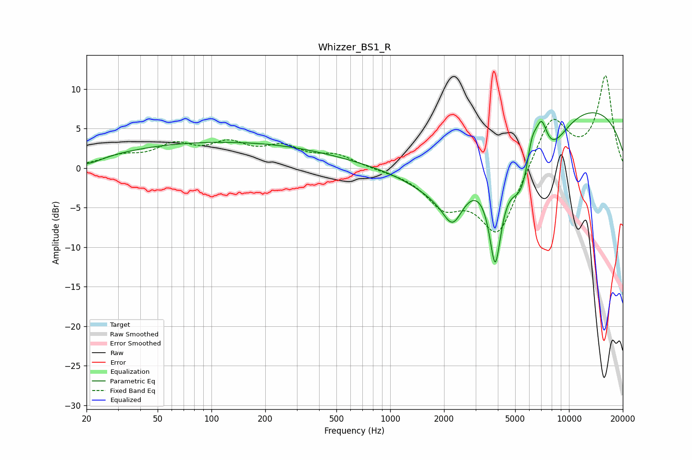

# Whizzer_BS1_R
See [usage instructions](https://github.com/jaakkopasanen/AutoEq#usage) for more options and info.

### Parametric EQs
Apply preamp of -7.1 dB when using parametric equalizer.

|   # | Type    |   Fc (Hz) |    Q |   Gain (dB) |
|-----|---------|-----------|------|-------------|
|   1 | Peaking |        20 | 1.91 |        -0.7 |
|   2 | Peaking |       116 | 0.22 |         3.3 |
|   3 | Peaking |      2101 | 0.7  |        -6.7 |
|   4 | Peaking |      2237 | 2.62 |        -3.8 |
|   5 | Peaking |      3867 | 3.8  |       -12.5 |
|   6 | Peaking |      5445 | 2.06 |        -6.5 |
|   7 | Peaking |      6189 | 4.51 |         4   |
|   8 | Peaking |      7015 | 3.91 |         4.8 |
|   9 | Peaking |      7616 | 1.2  |        -4.8 |
|  10 | Peaking |      9037 | 0.2  |         8.8 |

### Fixed Band EQs
When using fixed band (also called graphic) equalizer, apply preamp of **-11.8 dB** (if available) and set gains manually with these parameters.

|   # | Type    |   Fc (Hz) |    Q |   Gain (dB) |
|-----|---------|-----------|------|-------------|
|   1 | Peaking |        31 | 1.41 |         1.3 |
|   2 | Peaking |        62 | 1.41 |         2.5 |
|   3 | Peaking |       125 | 1.41 |         2.6 |
|   4 | Peaking |       250 | 1.41 |         2.3 |
|   5 | Peaking |       500 | 1.41 |         1.5 |
|   6 | Peaking |      1000 | 1.41 |        -0.2 |
|   7 | Peaking |      2000 | 1.41 |        -4.2 |
|   8 | Peaking |      4000 | 1.41 |        -8.5 |
|   9 | Peaking |      8000 | 1.41 |         6.8 |
|  10 | Peaking |     16000 | 1.41 |        11.5 |

### Graphs

