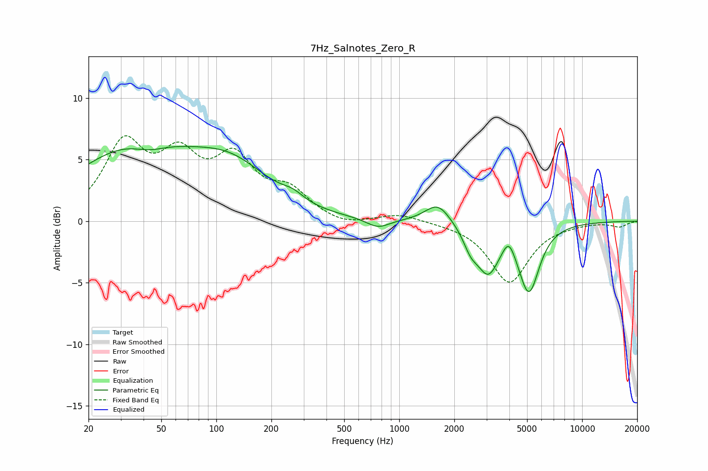

# 7Hz_Salnotes_Zero_R
See [usage instructions](https://github.com/jaakkopasanen/AutoEq#usage) for more options and info.

### Parametric EQs
Apply preamp of -6.2 dB when using parametric equalizer.

|   # | Type    |   Fc (Hz) |    Q |   Gain (dB) |
|-----|---------|-----------|------|-------------|
|   1 | Peaking |        36 | 0.42 |         5.9 |
|   2 | Peaking |        43 | 1.47 |        -0.9 |
|   3 | Peaking |       123 | 0.68 |         3.2 |
|   4 | Peaking |       262 | 2.41 |         0.6 |
|   5 | Peaking |       766 | 2.24 |        -0.8 |
|   6 | Peaking |      1627 | 2.04 |         1.7 |
|   7 | Peaking |      2457 | 3.53 |        -1.3 |
|   8 | Peaking |      3059 | 2.28 |        -3.7 |
|   9 | Peaking |      3971 | 4.31 |         1.3 |
|  10 | Peaking |      5117 | 2.46 |        -5.5 |

### Fixed Band EQs
When using fixed band (also called graphic) equalizer, apply preamp of **-7.0 dB** (if available) and set gains manually with these parameters.

|   # | Type    |   Fc (Hz) |    Q |   Gain (dB) |
|-----|---------|-----------|------|-------------|
|   1 | Peaking |        31 | 1.41 |         5.9 |
|   2 | Peaking |        62 | 1.41 |         4.4 |
|   3 | Peaking |       125 | 1.41 |         4.5 |
|   4 | Peaking |       250 | 1.41 |         2.1 |
|   5 | Peaking |       500 | 1.41 |        -0.5 |
|   6 | Peaking |      1000 | 1.41 |         0.6 |
|   7 | Peaking |      2000 | 1.41 |        -0.1 |
|   8 | Peaking |      4000 | 1.41 |        -4.9 |
|   9 | Peaking |      8000 | 1.41 |        -0.1 |
|  10 | Peaking |     16000 | 1.41 |        -0.4 |

### Graphs

