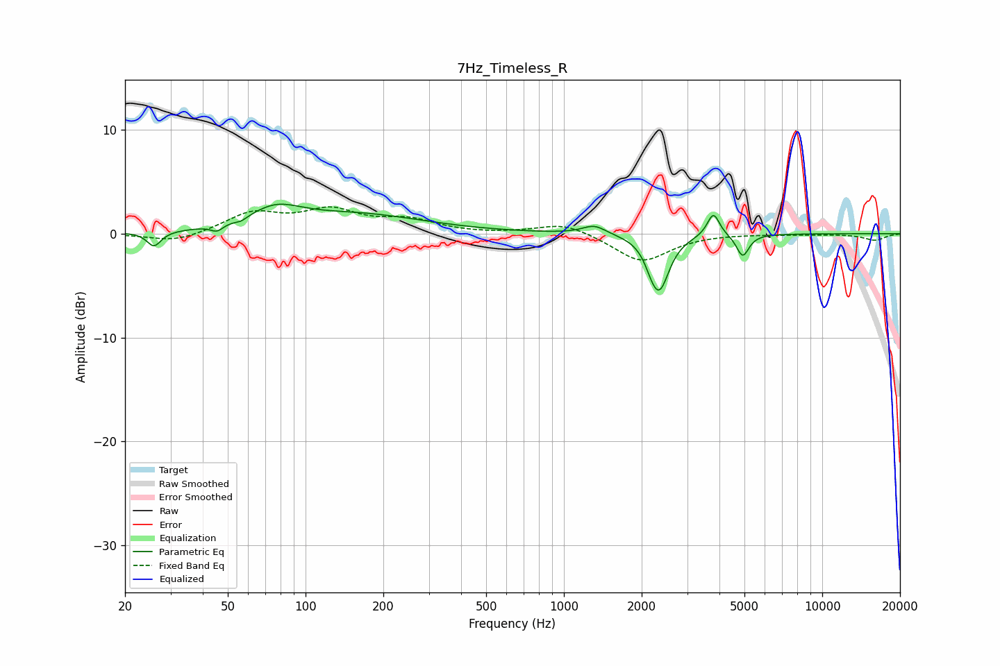

# 7Hz_Timeless_R
See [usage instructions](https://github.com/jaakkopasanen/AutoEq#usage) for more options and info.

### Parametric EQs
Apply preamp of -2.9 dB when using parametric equalizer.

|   # | Type    |   Fc (Hz) |    Q |   Gain (dB) |
|-----|---------|-----------|------|-------------|
|   1 | Peaking |        26 | 5.3  |        -1.4 |
|   2 | Peaking |        45 | 6    |        -0.6 |
|   3 | Peaking |        56 | 6    |        -0.3 |
|   4 | Peaking |        77 | 1.43 |         1.8 |
|   5 | Peaking |       158 | 0.54 |         1.8 |
|   6 | Peaking |      1311 | 3.14 |         0.9 |
|   7 | Peaking |      2175 | 6    |        -0.6 |
|   8 | Peaking |      2341 | 3.7  |        -5.2 |
|   9 | Peaking |      3791 | 6    |         2.3 |
|  10 | Peaking |      4923 | 5.92 |        -2.1 |

### Fixed Band EQs
When using fixed band (also called graphic) equalizer, apply preamp of **-2.7 dB** (if available) and set gains manually with these parameters.

|   # | Type    |   Fc (Hz) |    Q |   Gain (dB) |
|-----|---------|-----------|------|-------------|
|   1 | Peaking |        31 | 1.41 |        -0.9 |
|   2 | Peaking |        62 | 1.41 |         1.9 |
|   3 | Peaking |       125 | 1.41 |         2   |
|   4 | Peaking |       250 | 1.41 |         1.2 |
|   5 | Peaking |       500 | 1.41 |        -0.1 |
|   6 | Peaking |      1000 | 1.41 |         1.1 |
|   7 | Peaking |      2000 | 1.41 |        -2.7 |
|   8 | Peaking |      4000 | 1.41 |         0   |
|   9 | Peaking |      8000 | 1.41 |        -0.1 |
|  10 | Peaking |     16000 | 1.41 |        -0.6 |

### Graphs

