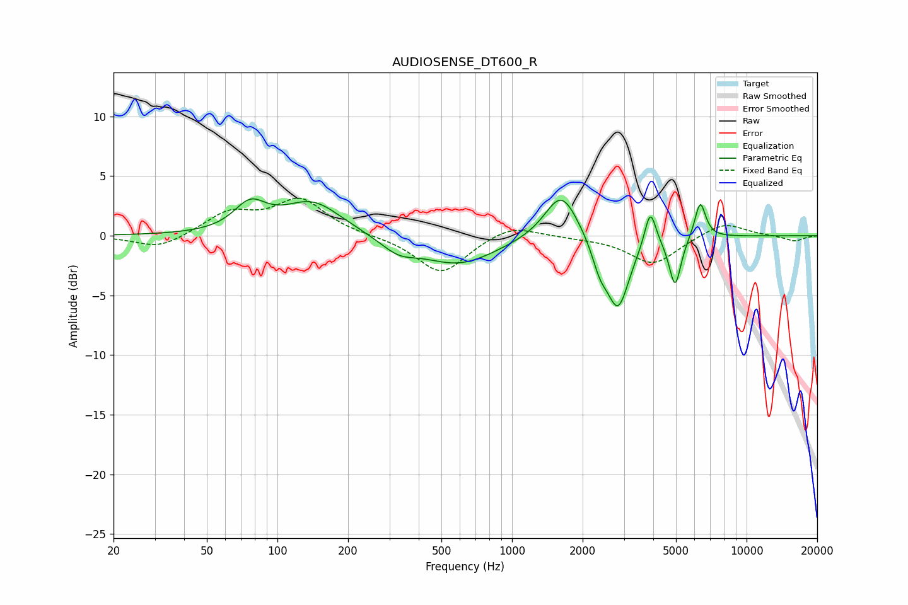

# AUDIOSENSE_DT600_R
See [usage instructions](https://github.com/jaakkopasanen/AutoEq#usage) for more options and info.

### Parametric EQs
Apply preamp of -3.2 dB when using parametric equalizer.

|   # | Type    |   Fc (Hz) |    Q |   Gain (dB) |
|-----|---------|-----------|------|-------------|
|   1 | Peaking |        76 | 2.09 |         2.2 |
|   2 | Peaking |       141 | 1.13 |         2.8 |
|   3 | Peaking |       328 | 1.9  |        -1.1 |
|   4 | Peaking |       591 | 0.87 |        -2.4 |
|   5 | Peaking |      1625 | 2    |         4   |
|   6 | Peaking |      2366 | 4.25 |        -1.9 |
|   7 | Peaking |      2830 | 2.89 |        -5.9 |
|   8 | Peaking |      3885 | 5.79 |         3.2 |
|   9 | Peaking |      4957 | 5.56 |        -4.1 |
|  10 | Peaking |      6342 | 5.89 |         3.1 |

### Fixed Band EQs
When using fixed band (also called graphic) equalizer, apply preamp of **-3.2 dB** (if available) and set gains manually with these parameters.

|   # | Type    |   Fc (Hz) |    Q |   Gain (dB) |
|-----|---------|-----------|------|-------------|
|   1 | Peaking |        31 | 1.41 |        -1.1 |
|   2 | Peaking |        62 | 1.41 |         1.8 |
|   3 | Peaking |       125 | 1.41 |         2.9 |
|   4 | Peaking |       250 | 1.41 |        -0   |
|   5 | Peaking |       500 | 1.41 |        -3.2 |
|   6 | Peaking |      1000 | 1.41 |         1   |
|   7 | Peaking |      2000 | 1.41 |        -0.1 |
|   8 | Peaking |      4000 | 1.41 |        -2.4 |
|   9 | Peaking |      8000 | 1.41 |         1.2 |
|  10 | Peaking |     16000 | 1.41 |        -0.5 |

### Graphs

