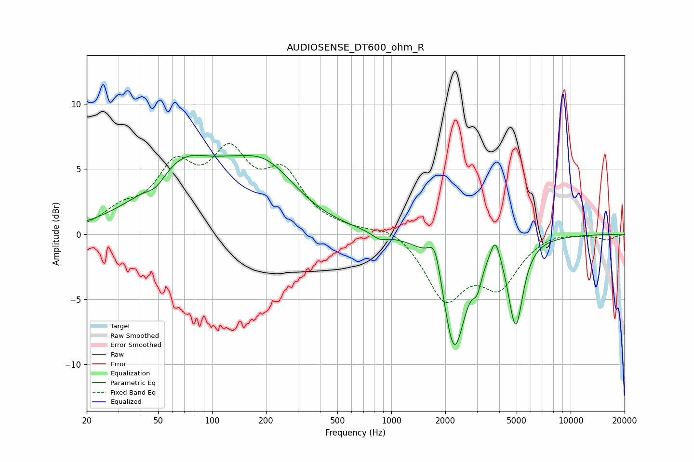

# AUDIOSENSE_DT600_ohm_R
See [usage instructions](https://github.com/jaakkopasanen/AutoEq#usage) for more options and info.

### Parametric EQs
Apply preamp of -6.2 dB when using parametric equalizer.

|   # | Type    |   Fc (Hz) |    Q |   Gain (dB) |
|-----|---------|-----------|------|-------------|
|   1 | Peaking |        49 | 2.6  |        -0.9 |
|   2 | Peaking |        77 | 0.62 |         5.9 |
|   3 | Peaking |        92 | 1.37 |        -0.8 |
|   4 | Peaking |       202 | 0.81 |         3.8 |
|   5 | Peaking |       860 | 3.36 |        -0.5 |
|   6 | Peaking |      1754 | 3.92 |         2.5 |
|   7 | Peaking |      2239 | 2.24 |        -8.8 |
|   8 | Peaking |      3010 | 6    |        -1.5 |
|   9 | Peaking |      3802 | 5.08 |         2   |
|  10 | Peaking |      4939 | 3.47 |        -6.6 |

### Fixed Band EQs
When using fixed band (also called graphic) equalizer, apply preamp of **-7.1 dB** (if available) and set gains manually with these parameters.

|   # | Type    |   Fc (Hz) |    Q |   Gain (dB) |
|-----|---------|-----------|------|-------------|
|   1 | Peaking |        31 | 1.41 |         1.5 |
|   2 | Peaking |        62 | 1.41 |         4.5 |
|   3 | Peaking |       125 | 1.41 |         5.3 |
|   4 | Peaking |       250 | 1.41 |         4.1 |
|   5 | Peaking |       500 | 1.41 |         0.2 |
|   6 | Peaking |      1000 | 1.41 |         0.7 |
|   7 | Peaking |      2000 | 1.41 |        -4.8 |
|   8 | Peaking |      4000 | 1.41 |        -3.6 |
|   9 | Peaking |      8000 | 1.41 |         0.3 |
|  10 | Peaking |     16000 | 1.41 |        -0.4 |

### Graphs

