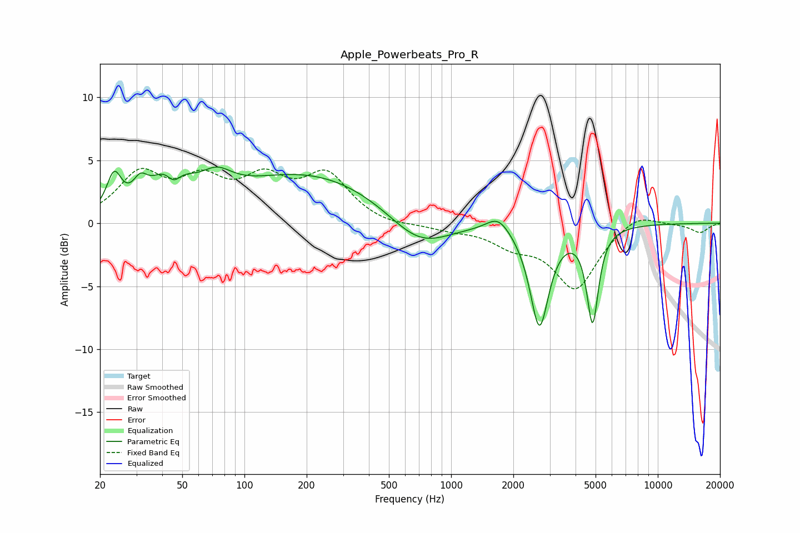

# Apple_Powerbeats_Pro_R
See [usage instructions](https://github.com/jaakkopasanen/AutoEq#usage) for more options and info.

### Parametric EQs
Apply preamp of -4.6 dB when using parametric equalizer.

|   # | Type    |   Fc (Hz) |    Q |   Gain (dB) |
|-----|---------|-----------|------|-------------|
|   1 | Peaking |        23 | 3.99 |         3   |
|   2 | Peaking |        31 | 4.09 |         1.5 |
|   3 | Peaking |        44 | 1.81 |         3.9 |
|   4 | Peaking |        45 | 3.61 |        -2.1 |
|   5 | Peaking |        73 | 1.85 |         1.6 |
|   6 | Peaking |       206 | 0.38 |         3.9 |
|   7 | Peaking |       701 | 0.94 |        -2.7 |
|   8 | Peaking |      1691 | 2.53 |         1.2 |
|   9 | Peaking |      2674 | 3.09 |        -8.1 |
|  10 | Peaking |      4837 | 4.99 |        -7.4 |

### Fixed Band EQs
When using fixed band (also called graphic) equalizer, apply preamp of **-4.4 dB** (if available) and set gains manually with these parameters.

|   # | Type    |   Fc (Hz) |    Q |   Gain (dB) |
|-----|---------|-----------|------|-------------|
|   1 | Peaking |        31 | 1.41 |         3.7 |
|   2 | Peaking |        62 | 1.41 |         2.9 |
|   3 | Peaking |       125 | 1.41 |         3   |
|   4 | Peaking |       250 | 1.41 |         3.6 |
|   5 | Peaking |       500 | 1.41 |        -0.3 |
|   6 | Peaking |      1000 | 1.41 |        -0.4 |
|   7 | Peaking |      2000 | 1.41 |        -1.4 |
|   8 | Peaking |      4000 | 1.41 |        -5.1 |
|   9 | Peaking |      8000 | 1.41 |         1   |
|  10 | Peaking |     16000 | 1.41 |        -0.7 |

### Graphs

