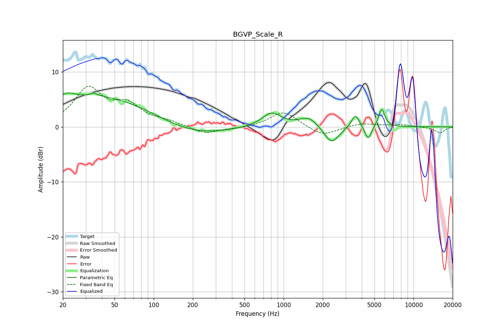

# BGVP_Scale_R
See [usage instructions](https://github.com/jaakkopasanen/AutoEq#usage) for more options and info.

### Parametric EQs
Apply preamp of -6.3 dB when using parametric equalizer.

|   # | Type    |   Fc (Hz) |    Q |   Gain (dB) |
|-----|---------|-----------|------|-------------|
|   1 | Peaking |        21 | 2.38 |         1.4 |
|   2 | Peaking |        35 | 5.92 |         0.5 |
|   3 | Peaking |        37 | 0.34 |         5.6 |
|   4 | Peaking |       198 | 0.58 |        -1.9 |
|   5 | Peaking |       808 | 1.89 |         2.6 |
|   6 | Peaking |      1556 | 2.04 |         1.8 |
|   7 | Peaking |      2335 | 2.54 |        -3.2 |
|   8 | Peaking |      3571 | 4.71 |         2.5 |
|   9 | Peaking |      4470 | 5.66 |        -2.6 |
|  10 | Peaking |      5684 | 5.73 |         3.4 |

### Fixed Band EQs
When using fixed band (also called graphic) equalizer, apply preamp of **-7.5 dB** (if available) and set gains manually with these parameters.

|   # | Type    |   Fc (Hz) |    Q |   Gain (dB) |
|-----|---------|-----------|------|-------------|
|   1 | Peaking |        31 | 1.41 |         6.7 |
|   2 | Peaking |        62 | 1.41 |         3.5 |
|   3 | Peaking |       125 | 1.41 |         0.8 |
|   4 | Peaking |       250 | 1.41 |        -1.3 |
|   5 | Peaking |       500 | 1.41 |        -0.3 |
|   6 | Peaking |      1000 | 1.41 |         2.9 |
|   7 | Peaking |      2000 | 1.41 |        -1.8 |
|   8 | Peaking |      4000 | 1.41 |         0.7 |
|   9 | Peaking |      8000 | 1.41 |         0.4 |
|  10 | Peaking |     16000 | 1.41 |        -1.1 |

### Graphs

