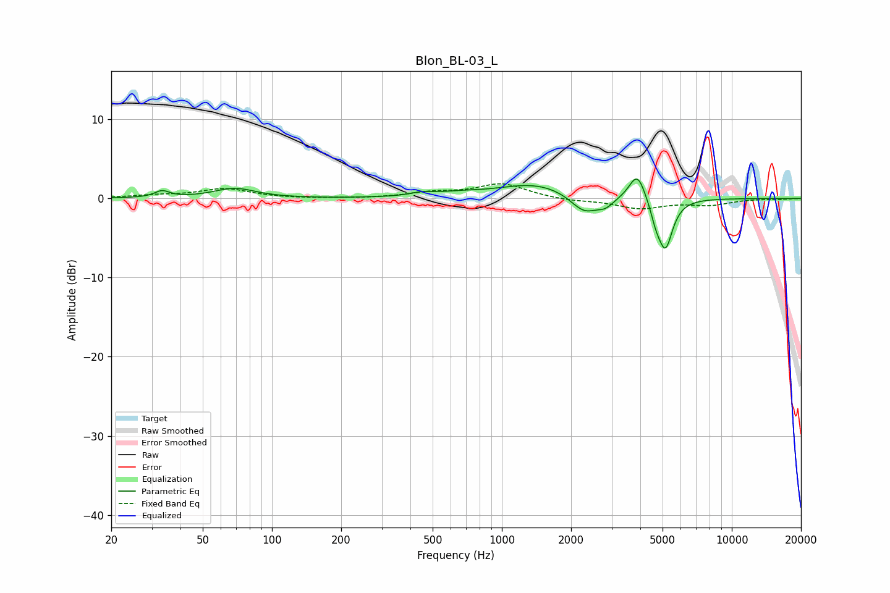

# Blon_BL-03_L
See [usage instructions](https://github.com/jaakkopasanen/AutoEq#usage) for more options and info.

### Parametric EQs
Apply preamp of -2.5 dB when using parametric equalizer.

|   # | Type    |   Fc (Hz) |    Q |   Gain (dB) |
|-----|---------|-----------|------|-------------|
|   1 | Peaking |        33 | 4.52 |         0.8 |
|   2 | Peaking |        69 | 1.57 |         1.2 |
|   3 | Peaking |       445 | 3.05 |         0.4 |
|   4 | Peaking |       632 | 1.22 |         0.4 |
|   5 | Peaking |      1412 | 0.89 |         1.8 |
|   6 | Peaking |      2276 | 2.37 |        -2.3 |
|   7 | Peaking |      2819 | 3.72 |        -1   |
|   8 | Peaking |      3885 | 3.95 |         3.6 |
|   9 | Peaking |      4680 | 6    |        -1.8 |
|  10 | Peaking |      5145 | 4.42 |        -6.1 |

### Fixed Band EQs
When using fixed band (also called graphic) equalizer, apply preamp of **-1.9 dB** (if available) and set gains manually with these parameters.

|   # | Type    |   Fc (Hz) |    Q |   Gain (dB) |
|-----|---------|-----------|------|-------------|
|   1 | Peaking |        31 | 1.41 |         0.3 |
|   2 | Peaking |        62 | 1.41 |         1.2 |
|   3 | Peaking |       125 | 1.41 |        -0   |
|   4 | Peaking |       250 | 1.41 |        -0   |
|   5 | Peaking |       500 | 1.41 |         0.7 |
|   6 | Peaking |      1000 | 1.41 |         1.8 |
|   7 | Peaking |      2000 | 1.41 |        -0.3 |
|   8 | Peaking |      4000 | 1.41 |        -1.2 |
|   9 | Peaking |      8000 | 1.41 |        -0.7 |
|  10 | Peaking |     16000 | 1.41 |        -0.1 |

### Graphs

