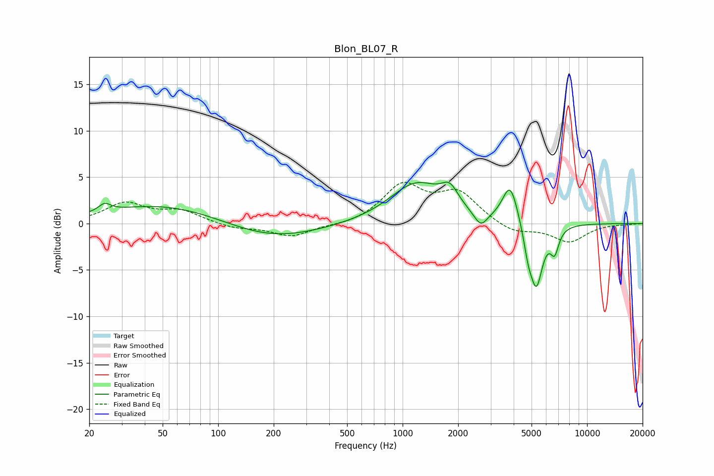

# Blon_BL07_R
See [usage instructions](https://github.com/jaakkopasanen/AutoEq#usage) for more options and info.

### Parametric EQs
Apply preamp of -4.6 dB when using parametric equalizer.

|   # | Type    |   Fc (Hz) |    Q |   Gain (dB) |
|-----|---------|-----------|------|-------------|
|   1 | Peaking |        24 | 4.4  |         0.8 |
|   2 | Peaking |        52 | 0.43 |         2.2 |
|   3 | Peaking |       190 | 0.54 |        -1.9 |
|   4 | Peaking |      1190 | 0.97 |         4.3 |
|   5 | Peaking |      1802 | 3.09 |         2   |
|   6 | Peaking |      2651 | 3.88 |        -1.6 |
|   7 | Peaking |      3831 | 3.37 |         4.3 |
|   8 | Peaking |      4785 | 6    |        -2   |
|   9 | Peaking |      5306 | 3.94 |        -6.7 |
|  10 | Peaking |      6670 | 6    |        -2.4 |

### Fixed Band EQs
When using fixed band (also called graphic) equalizer, apply preamp of **-4.5 dB** (if available) and set gains manually with these parameters.

|   # | Type    |   Fc (Hz) |    Q |   Gain (dB) |
|-----|---------|-----------|------|-------------|
|   1 | Peaking |        31 | 1.41 |         2.1 |
|   2 | Peaking |        62 | 1.41 |         1.3 |
|   3 | Peaking |       125 | 1.41 |        -0.5 |
|   4 | Peaking |       250 | 1.41 |        -1.4 |
|   5 | Peaking |       500 | 1.41 |        -0.3 |
|   6 | Peaking |      1000 | 1.41 |         4   |
|   7 | Peaking |      2000 | 1.41 |         3.1 |
|   8 | Peaking |      4000 | 1.41 |        -1.1 |
|   9 | Peaking |      8000 | 1.41 |        -1.9 |
|  10 | Peaking |     16000 | 1.41 |        -0.1 |

### Graphs

