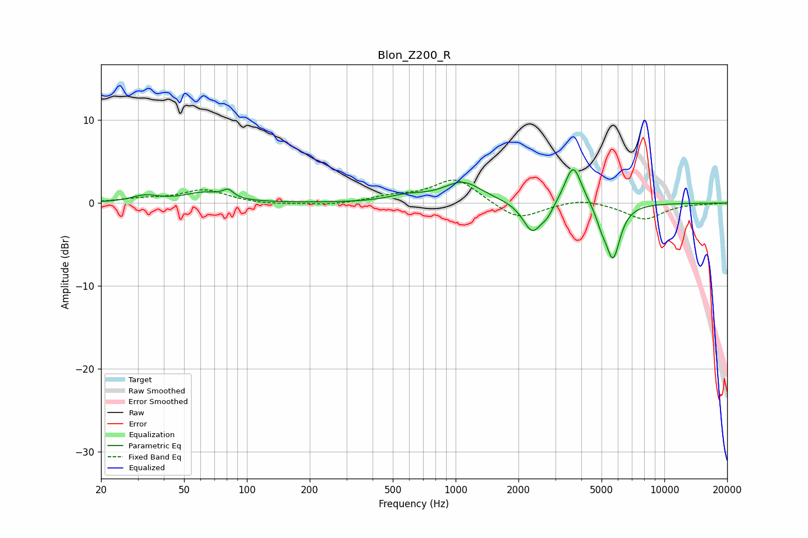

# Blon_Z200_R
See [usage instructions](https://github.com/jaakkopasanen/AutoEq#usage) for more options and info.

### Parametric EQs
Apply preamp of -4.1 dB when using parametric equalizer.

|   # | Type    |   Fc (Hz) |    Q |   Gain (dB) |
|-----|---------|-----------|------|-------------|
|   1 | Peaking |        32 | 2.23 |         0.8 |
|   2 | Peaking |        62 | 1.5  |         1.2 |
|   3 | Peaking |        81 | 5.66 |         0.9 |
|   4 | Peaking |       583 | 1.63 |         0.7 |
|   5 | Peaking |      1082 | 1.51 |         2.5 |
|   6 | Peaking |      2327 | 3.15 |        -3.6 |
|   7 | Peaking |      2746 | 4.63 |        -1.1 |
|   8 | Peaking |      3660 | 3.47 |         4.9 |
|   9 | Peaking |      4995 | 5.4  |        -1.4 |
|  10 | Peaking |      5673 | 3.98 |        -6.6 |

### Fixed Band EQs
When using fixed band (also called graphic) equalizer, apply preamp of **-2.9 dB** (if available) and set gains manually with these parameters.

|   # | Type    |   Fc (Hz) |    Q |   Gain (dB) |
|-----|---------|-----------|------|-------------|
|   1 | Peaking |        31 | 1.41 |         0.4 |
|   2 | Peaking |        62 | 1.41 |         1.6 |
|   3 | Peaking |       125 | 1.41 |        -0.2 |
|   4 | Peaking |       250 | 1.41 |        -0.3 |
|   5 | Peaking |       500 | 1.41 |         0.7 |
|   6 | Peaking |      1000 | 1.41 |         3   |
|   7 | Peaking |      2000 | 1.41 |        -2.1 |
|   8 | Peaking |      4000 | 1.41 |         0.6 |
|   9 | Peaking |      8000 | 1.41 |        -2   |
|  10 | Peaking |     16000 | 1.41 |        -0.1 |

### Graphs

