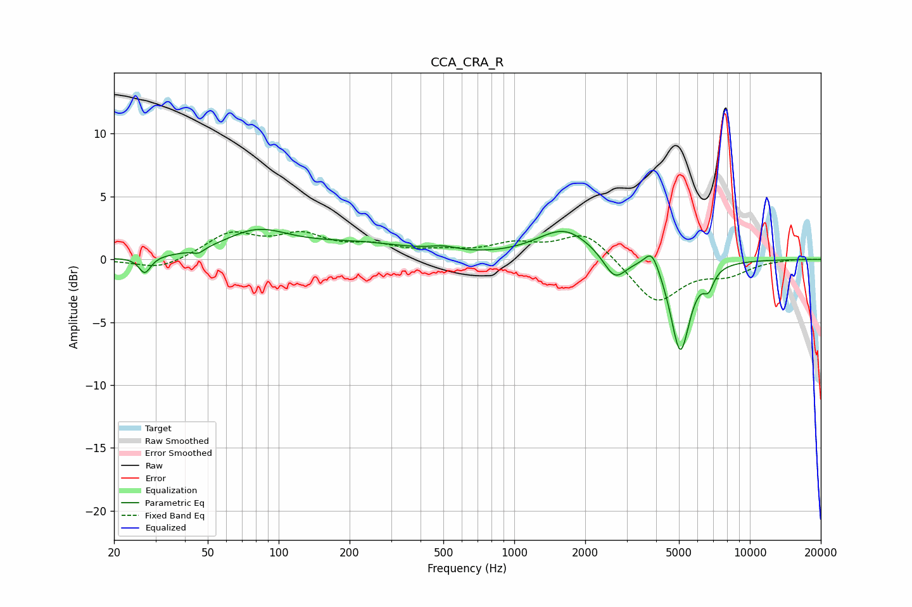

# CCA_CRA_R
See [usage instructions](https://github.com/jaakkopasanen/AutoEq#usage) for more options and info.

### Parametric EQs
Apply preamp of -2.5 dB when using parametric equalizer.

|   # | Type    |   Fc (Hz) |    Q |   Gain (dB) |
|-----|---------|-----------|------|-------------|
|   1 | Peaking |        27 | 5.83 |        -1.3 |
|   2 | Peaking |        46 | 5.68 |        -0.4 |
|   3 | Peaking |        81 | 1.02 |         2   |
|   4 | Peaking |       218 | 0.6  |         1.1 |
|   5 | Peaking |       501 | 2.47 |         0.4 |
|   6 | Peaking |      1635 | 1.21 |         2.4 |
|   7 | Peaking |      2670 | 2.96 |        -2   |
|   8 | Peaking |      3841 | 4.43 |         1.7 |
|   9 | Peaking |      5065 | 3.39 |        -7.4 |
|  10 | Peaking |      6678 | 6    |        -1.4 |

### Fixed Band EQs
When using fixed band (also called graphic) equalizer, apply preamp of **-2.3 dB** (if available) and set gains manually with these parameters.

|   # | Type    |   Fc (Hz) |    Q |   Gain (dB) |
|-----|---------|-----------|------|-------------|
|   1 | Peaking |        31 | 1.41 |        -0.9 |
|   2 | Peaking |        62 | 1.41 |         2   |
|   3 | Peaking |       125 | 1.41 |         1.7 |
|   4 | Peaking |       250 | 1.41 |         0.9 |
|   5 | Peaking |       500 | 1.41 |         0.5 |
|   6 | Peaking |      1000 | 1.41 |         1.1 |
|   7 | Peaking |      2000 | 1.41 |         2.2 |
|   8 | Peaking |      4000 | 1.41 |        -3.5 |
|   9 | Peaking |      8000 | 1.41 |        -1   |
|  10 | Peaking |     16000 | 1.41 |         0.1 |

### Graphs

