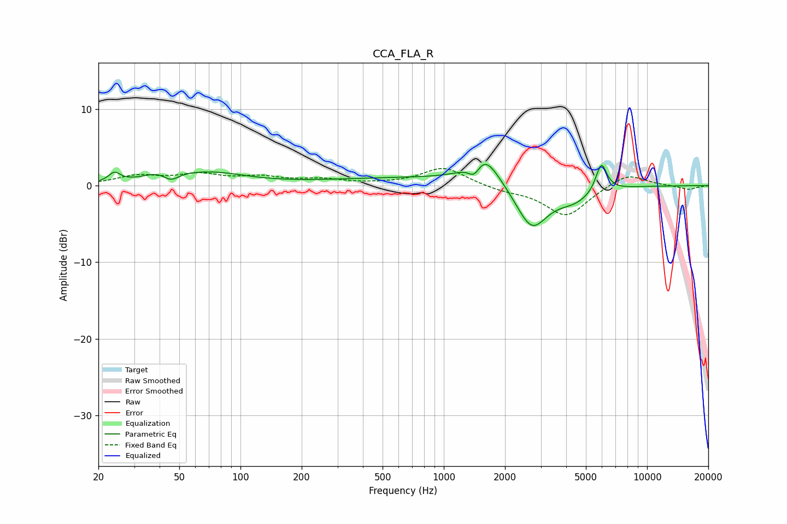

# CCA_FLA_R
See [usage instructions](https://github.com/jaakkopasanen/AutoEq#usage) for more options and info.

### Parametric EQs
Apply preamp of -2.9 dB when using parametric equalizer.

|   # | Type    |   Fc (Hz) |    Q |   Gain (dB) |
|-----|---------|-----------|------|-------------|
|   1 | Peaking |        24 | 4.9  |         1.2 |
|   2 | Peaking |        42 | 1.68 |         1.5 |
|   3 | Peaking |        45 | 3.27 |        -1.6 |
|   4 | Peaking |        72 | 0.82 |         1.5 |
|   5 | Peaking |       833 | 0.27 |         1   |
|   6 | Peaking |      1412 | 4.75 |        -1.9 |
|   7 | Peaking |      1567 | 1.97 |         4   |
|   8 | Peaking |      2705 | 1.8  |        -5.9 |
|   9 | Peaking |      4398 | 1.47 |        -1.8 |
|  10 | Peaking |      5957 | 5    |         3.8 |

### Fixed Band EQs
When using fixed band (also called graphic) equalizer, apply preamp of **-2.3 dB** (if available) and set gains manually with these parameters.

|   # | Type    |   Fc (Hz) |    Q |   Gain (dB) |
|-----|---------|-----------|------|-------------|
|   1 | Peaking |        31 | 1.41 |         1.2 |
|   2 | Peaking |        62 | 1.41 |         1.3 |
|   3 | Peaking |       125 | 1.41 |         1   |
|   4 | Peaking |       250 | 1.41 |         0.7 |
|   5 | Peaking |       500 | 1.41 |         0.1 |
|   6 | Peaking |      1000 | 1.41 |         2.4 |
|   7 | Peaking |      2000 | 1.41 |        -0.6 |
|   8 | Peaking |      4000 | 1.41 |        -4   |
|   9 | Peaking |      8000 | 1.41 |         1.7 |
|  10 | Peaking |     16000 | 1.41 |        -0.5 |

### Graphs

