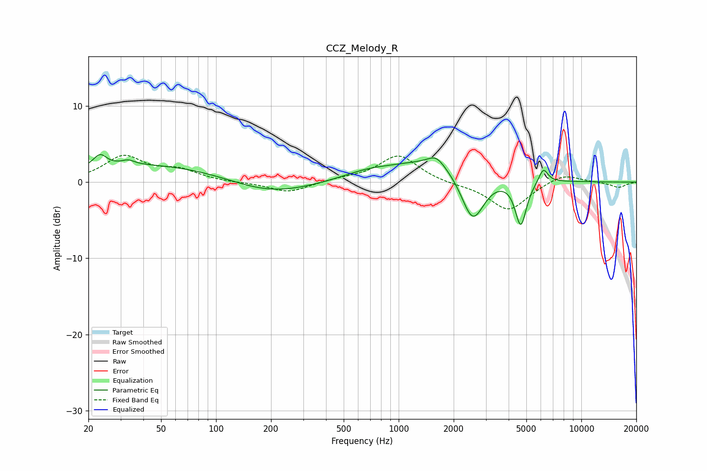

# CCZ_Melody_R
See [usage instructions](https://github.com/jaakkopasanen/AutoEq#usage) for more options and info.

### Parametric EQs
Apply preamp of -3.7 dB when using parametric equalizer.

|   # | Type    |   Fc (Hz) |    Q |   Gain (dB) |
|-----|---------|-----------|------|-------------|
|   1 | Peaking |        23 | 3.95 |         1.6 |
|   2 | Peaking |        33 | 3.93 |         0.6 |
|   3 | Peaking |        62 | 0.23 |         2.6 |
|   4 | Peaking |       191 | 0.57 |        -2.9 |
|   5 | Peaking |       679 | 0.95 |         0.9 |
|   6 | Peaking |      1606 | 3.24 |         1.2 |
|   7 | Peaking |      1751 | 0.58 |         3.2 |
|   8 | Peaking |      2542 | 2.11 |        -7.2 |
|   9 | Peaking |      4663 | 4.52 |        -6   |
|  10 | Peaking |      6198 | 5.53 |         1.9 |

### Fixed Band EQs
When using fixed band (also called graphic) equalizer, apply preamp of **-3.6 dB** (if available) and set gains manually with these parameters.

|   # | Type    |   Fc (Hz) |    Q |   Gain (dB) |
|-----|---------|-----------|------|-------------|
|   1 | Peaking |        31 | 1.41 |         3.3 |
|   2 | Peaking |        62 | 1.41 |         1.4 |
|   3 | Peaking |       125 | 1.41 |        -0.1 |
|   4 | Peaking |       250 | 1.41 |        -1.4 |
|   5 | Peaking |       500 | 1.41 |         0.4 |
|   6 | Peaking |      1000 | 1.41 |         3.6 |
|   7 | Peaking |      2000 | 1.41 |        -0.3 |
|   8 | Peaking |      4000 | 1.41 |        -3.7 |
|   9 | Peaking |      8000 | 1.41 |         1.2 |
|  10 | Peaking |     16000 | 1.41 |        -0.7 |

### Graphs

