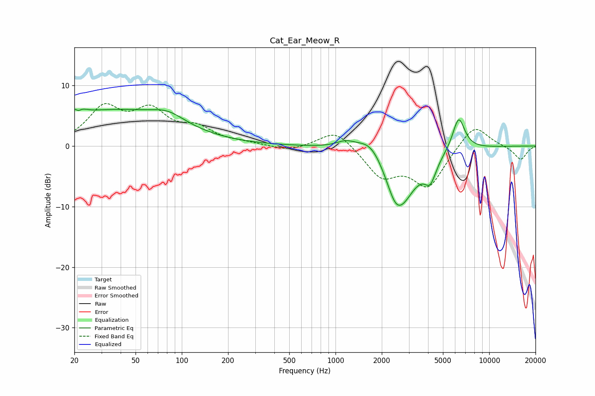

# Cat_Ear_Meow_R
See [usage instructions](https://github.com/jaakkopasanen/AutoEq#usage) for more options and info.

### Parametric EQs
Apply preamp of -6.2 dB when using parametric equalizer.

|   # | Type    |   Fc (Hz) |    Q |   Gain (dB) |
|-----|---------|-----------|------|-------------|
|   1 | Peaking |        21 | 4.51 |         3.9 |
|   2 | Peaking |        21 | 6    |        -3.1 |
|   3 | Peaking |        35 | 0.35 |         5.7 |
|   4 | Peaking |        81 | 1.3  |         1.7 |
|   5 | Peaking |      1162 | 2.32 |         1.1 |
|   6 | Peaking |      1715 | 1.53 |         3.6 |
|   7 | Peaking |      2431 | 3.28 |        -1.4 |
|   8 | Peaking |      2622 | 1.33 |        -9.9 |
|   9 | Peaking |      4138 | 3.76 |        -3.3 |
|  10 | Peaking |      6325 | 3.4  |         5.7 |

### Fixed Band EQs
When using fixed band (also called graphic) equalizer, apply preamp of **-7.1 dB** (if available) and set gains manually with these parameters.

|   # | Type    |   Fc (Hz) |    Q |   Gain (dB) |
|-----|---------|-----------|------|-------------|
|   1 | Peaking |        31 | 1.41 |         5.9 |
|   2 | Peaking |        62 | 1.41 |         5.2 |
|   3 | Peaking |       125 | 1.41 |         2.5 |
|   4 | Peaking |       250 | 1.41 |         0.4 |
|   5 | Peaking |       500 | 1.41 |        -0.9 |
|   6 | Peaking |      1000 | 1.41 |         2.9 |
|   7 | Peaking |      2000 | 1.41 |        -4.8 |
|   8 | Peaking |      4000 | 1.41 |        -6.5 |
|   9 | Peaking |      8000 | 1.41 |         3.9 |
|  10 | Peaking |     16000 | 1.41 |        -2.3 |

### Graphs

