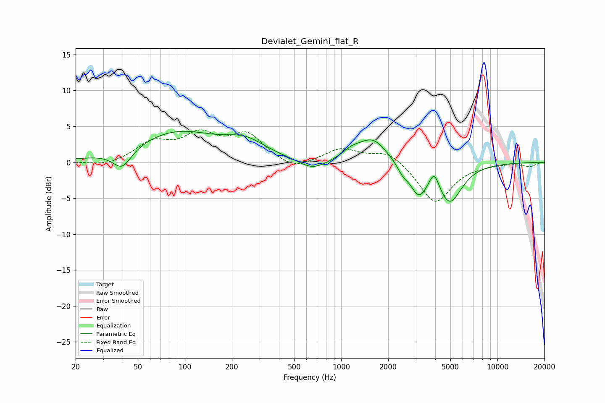

# Devialet_Gemini_flat_R
See [usage instructions](https://github.com/jaakkopasanen/AutoEq#usage) for more options and info.

### Parametric EQs
Apply preamp of -4.4 dB when using parametric equalizer.

|   # | Type    |   Fc (Hz) |    Q |   Gain (dB) |
|-----|---------|-----------|------|-------------|
|   1 | Peaking |        40 | 2.37 |        -2.7 |
|   2 | Peaking |        89 | 0.54 |         4.1 |
|   3 | Peaking |       245 | 1.1  |         2.1 |
|   4 | Peaking |       659 | 1.59 |        -1.5 |
|   5 | Peaking |      1165 | 2.42 |         0.9 |
|   6 | Peaking |      1591 | 1.52 |         3.3 |
|   7 | Peaking |      2478 | 3.98 |        -1.1 |
|   8 | Peaking |      3138 | 2.59 |        -4   |
|   9 | Peaking |      3940 | 4.49 |         2.4 |
|  10 | Peaking |      4941 | 1.79 |        -5.5 |

### Fixed Band EQs
When using fixed band (also called graphic) equalizer, apply preamp of **-4.6 dB** (if available) and set gains manually with these parameters.

|   # | Type    |   Fc (Hz) |    Q |   Gain (dB) |
|-----|---------|-----------|------|-------------|
|   1 | Peaking |        31 | 1.41 |        -0.6 |
|   2 | Peaking |        62 | 1.41 |         2.6 |
|   3 | Peaking |       125 | 1.41 |         3.4 |
|   4 | Peaking |       250 | 1.41 |         3.6 |
|   5 | Peaking |       500 | 1.41 |        -1.3 |
|   6 | Peaking |      1000 | 1.41 |         1.9 |
|   7 | Peaking |      2000 | 1.41 |         1.7 |
|   8 | Peaking |      4000 | 1.41 |        -5.7 |
|   9 | Peaking |      8000 | 1.41 |        -0.2 |
|  10 | Peaking |     16000 | 1.41 |        -0.5 |

### Graphs

