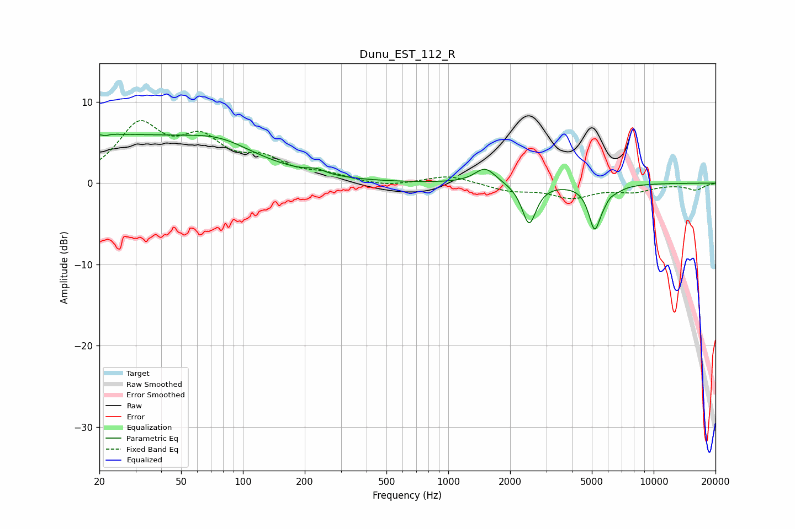

# Dunu_EST_112_R
See [usage instructions](https://github.com/jaakkopasanen/AutoEq#usage) for more options and info.

### Parametric EQs
Apply preamp of -6.1 dB when using parametric equalizer.

|   # | Type    |   Fc (Hz) |    Q |   Gain (dB) |
|-----|---------|-----------|------|-------------|
|   1 | Peaking |        21 | 5.61 |         3.4 |
|   2 | Peaking |        21 | 5.96 |        -3.5 |
|   3 | Peaking |        22 | 0.21 |         5.8 |
|   4 | Peaking |        78 | 0.94 |         1.6 |
|   5 | Peaking |       227 | 3.41 |         0.5 |
|   6 | Peaking |      1513 | 2.79 |         2   |
|   7 | Peaking |      2475 | 4.13 |        -5   |
|   8 | Peaking |      5153 | 4.87 |        -5   |
|   9 | Peaking |      6032 | 3.98 |        -3.9 |
|  10 | Peaking |      6072 | 4.84 |         3.2 |

### Fixed Band EQs
When using fixed band (also called graphic) equalizer, apply preamp of **-7.8 dB** (if available) and set gains manually with these parameters.

|   # | Type    |   Fc (Hz) |    Q |   Gain (dB) |
|-----|---------|-----------|------|-------------|
|   1 | Peaking |        31 | 1.41 |         6.7 |
|   2 | Peaking |        62 | 1.41 |         4.6 |
|   3 | Peaking |       125 | 1.41 |         2.4 |
|   4 | Peaking |       250 | 1.41 |         0.9 |
|   5 | Peaking |       500 | 1.41 |        -0.5 |
|   6 | Peaking |      1000 | 1.41 |         1   |
|   7 | Peaking |      2000 | 1.41 |        -0.9 |
|   8 | Peaking |      4000 | 1.41 |        -1.7 |
|   9 | Peaking |      8000 | 1.41 |        -0.9 |
|  10 | Peaking |     16000 | 1.41 |        -0.8 |

### Graphs

