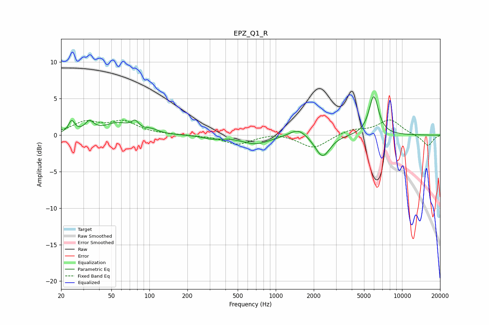

# EPZ_Q1_R
See [usage instructions](https://github.com/jaakkopasanen/AutoEq#usage) for more options and info.

### Parametric EQs
Apply preamp of -5.4 dB when using parametric equalizer.

|   # | Type    |   Fc (Hz) |    Q |   Gain (dB) |
|-----|---------|-----------|------|-------------|
|   1 | Peaking |        24 | 5.86 |         1.6 |
|   2 | Peaking |        34 | 4.1  |         1.4 |
|   3 | Peaking |        56 | 1.39 |         1.5 |
|   4 | Peaking |        77 | 5.13 |         1.1 |
|   5 | Peaking |       103 | 2.71 |         0.5 |
|   6 | Peaking |       313 | 2.04 |        -0.4 |
|   7 | Peaking |       696 | 1.27 |        -1.2 |
|   8 | Peaking |      1509 | 2.07 |         1.2 |
|   9 | Peaking |      2346 | 2.43 |        -3.1 |
|  10 | Peaking |      5969 | 3.64 |         5.4 |

### Fixed Band EQs
When using fixed band (also called graphic) equalizer, apply preamp of **-2.2 dB** (if available) and set gains manually with these parameters.

|   # | Type    |   Fc (Hz) |    Q |   Gain (dB) |
|-----|---------|-----------|------|-------------|
|   1 | Peaking |        31 | 1.41 |         1.7 |
|   2 | Peaking |        62 | 1.41 |         1.7 |
|   3 | Peaking |       125 | 1.41 |         0.1 |
|   4 | Peaking |       250 | 1.41 |        -0.1 |
|   5 | Peaking |       500 | 1.41 |        -1.3 |
|   6 | Peaking |      1000 | 1.41 |         0.4 |
|   7 | Peaking |      2000 | 1.41 |        -1.8 |
|   8 | Peaking |      4000 | 1.41 |         0.7 |
|   9 | Peaking |      8000 | 1.41 |         2.1 |
|  10 | Peaking |     16000 | 1.41 |        -1.5 |

### Graphs

