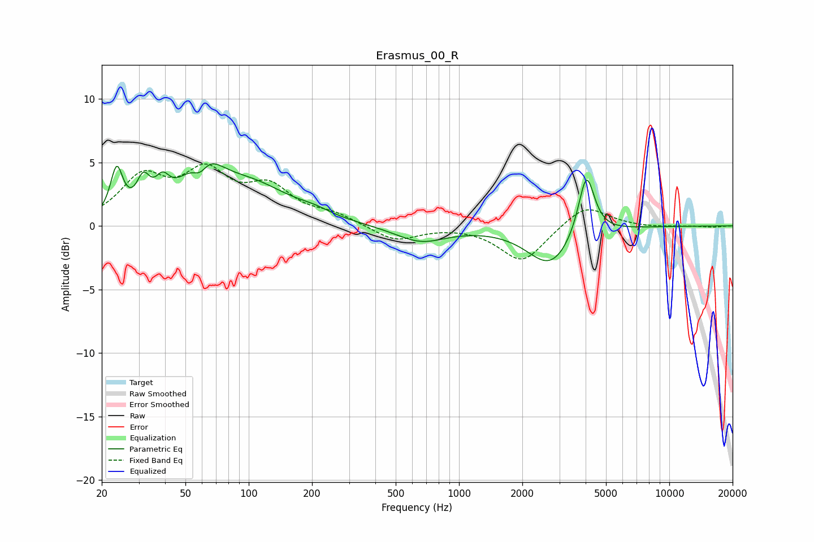

# Erasmus_00_R
See [usage instructions](https://github.com/jaakkopasanen/AutoEq#usage) for more options and info.

### Parametric EQs
Apply preamp of -5.0 dB when using parametric equalizer.

|   # | Type    |   Fc (Hz) |    Q |   Gain (dB) |
|-----|---------|-----------|------|-------------|
|   1 | Peaking |        24 | 4.91 |         3.8 |
|   2 | Peaking |        32 | 4.54 |         2.3 |
|   3 | Peaking |        39 | 4.22 |         1.7 |
|   4 | Peaking |        59 | 3.46 |        -2.1 |
|   5 | Peaking |        59 | 1.71 |         4.5 |
|   6 | Peaking |       102 | 0.74 |         2.9 |
|   7 | Peaking |       204 | 1.83 |         0.4 |
|   8 | Peaking |       656 | 1.17 |        -1.3 |
|   9 | Peaking |      2722 | 1.3  |        -3.1 |
|  10 | Peaking |      4033 | 3.66 |         5   |

### Fixed Band EQs
When using fixed band (also called graphic) equalizer, apply preamp of **-5.0 dB** (if available) and set gains manually with these parameters.

|   # | Type    |   Fc (Hz) |    Q |   Gain (dB) |
|-----|---------|-----------|------|-------------|
|   1 | Peaking |        31 | 1.41 |         3.5 |
|   2 | Peaking |        62 | 1.41 |         3.7 |
|   3 | Peaking |       125 | 1.41 |         2.7 |
|   4 | Peaking |       250 | 1.41 |         0.8 |
|   5 | Peaking |       500 | 1.41 |        -1.2 |
|   6 | Peaking |      1000 | 1.41 |         0   |
|   7 | Peaking |      2000 | 1.41 |        -2.9 |
|   8 | Peaking |      4000 | 1.41 |         1.8 |
|   9 | Peaking |      8000 | 1.41 |        -0.1 |
|  10 | Peaking |     16000 | 1.41 |        -0.1 |

### Graphs

