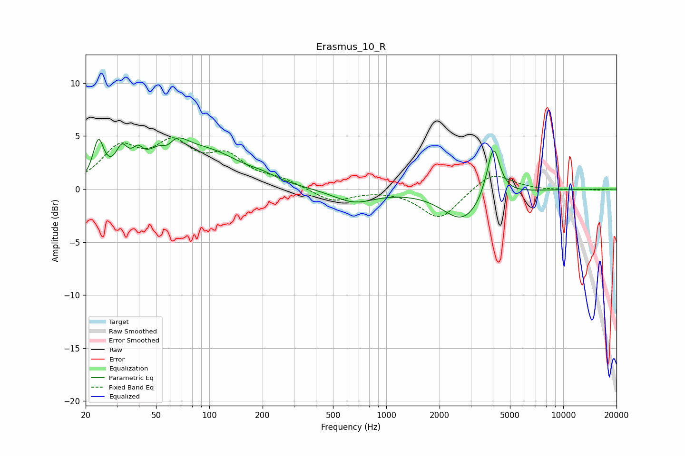

# Erasmus_10_R
See [usage instructions](https://github.com/jaakkopasanen/AutoEq#usage) for more options and info.

### Parametric EQs
Apply preamp of -4.9 dB when using parametric equalizer.

|   # | Type    |   Fc (Hz) |    Q |   Gain (dB) |
|-----|---------|-----------|------|-------------|
|   1 | Peaking |        24 | 4.74 |         3.7 |
|   2 | Peaking |        32 | 4.07 |         2.4 |
|   3 | Peaking |        39 | 4.73 |         1.4 |
|   4 | Peaking |        58 | 3.37 |        -2   |
|   5 | Peaking |        59 | 1.65 |         4.5 |
|   6 | Peaking |       103 | 0.79 |         2.9 |
|   7 | Peaking |       199 | 1.82 |         0.4 |
|   8 | Peaking |       657 | 1.2  |        -1.2 |
|   9 | Peaking |      2708 | 1.25 |        -3   |
|  10 | Peaking |      4029 | 3.84 |         5   |

### Fixed Band EQs
When using fixed band (also called graphic) equalizer, apply preamp of **-4.9 dB** (if available) and set gains manually with these parameters.

|   # | Type    |   Fc (Hz) |    Q |   Gain (dB) |
|-----|---------|-----------|------|-------------|
|   1 | Peaking |        31 | 1.41 |         3.5 |
|   2 | Peaking |        62 | 1.41 |         3.7 |
|   3 | Peaking |       125 | 1.41 |         2.7 |
|   4 | Peaking |       250 | 1.41 |         0.7 |
|   5 | Peaking |       500 | 1.41 |        -1.2 |
|   6 | Peaking |      1000 | 1.41 |         0   |
|   7 | Peaking |      2000 | 1.41 |        -2.8 |
|   8 | Peaking |      4000 | 1.41 |         1.7 |
|   9 | Peaking |      8000 | 1.41 |        -0.1 |
|  10 | Peaking |     16000 | 1.41 |        -0.1 |

### Graphs

