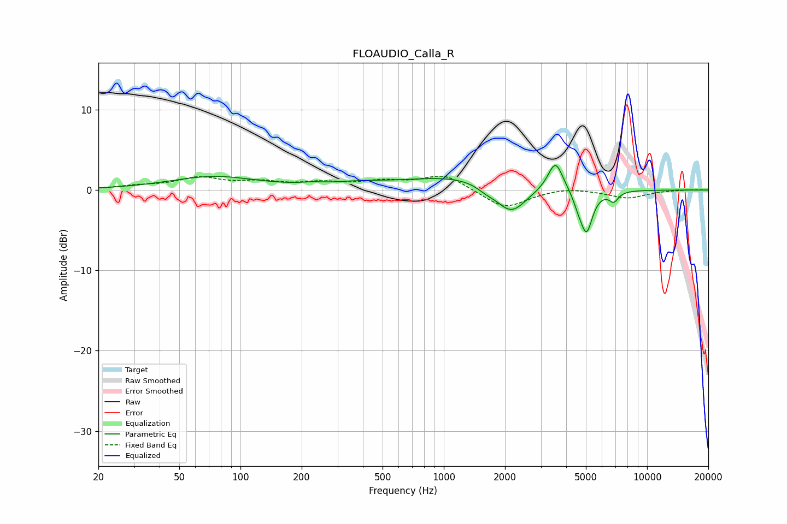

# FLOAUDIO_Calla_R
See [usage instructions](https://github.com/jaakkopasanen/AutoEq#usage) for more options and info.

### Parametric EQs
Apply preamp of -3.2 dB when using parametric equalizer.

|   # | Type    |   Fc (Hz) |    Q |   Gain (dB) |
|-----|---------|-----------|------|-------------|
|   1 | Peaking |        74 | 0.66 |         1.6 |
|   2 | Peaking |       226 | 2.84 |         0.2 |
|   3 | Peaking |       380 | 0.93 |         0.6 |
|   4 | Peaking |      1204 | 0.55 |         1.7 |
|   5 | Peaking |      1612 | 3.11 |        -0.6 |
|   6 | Peaking |      2142 | 1.88 |        -3.6 |
|   7 | Peaking |      3543 | 3.84 |         3.7 |
|   8 | Peaking |      4591 | 5.6  |        -1.1 |
|   9 | Peaking |      5035 | 4.66 |        -5.1 |
|  10 | Peaking |      6857 | 6    |        -1.2 |

### Fixed Band EQs
When using fixed band (also called graphic) equalizer, apply preamp of **-1.8 dB** (if available) and set gains manually with these parameters.

|   # | Type    |   Fc (Hz) |    Q |   Gain (dB) |
|-----|---------|-----------|------|-------------|
|   1 | Peaking |        31 | 1.41 |         0.4 |
|   2 | Peaking |        62 | 1.41 |         1.4 |
|   3 | Peaking |       125 | 1.41 |         0.8 |
|   4 | Peaking |       250 | 1.41 |         0.8 |
|   5 | Peaking |       500 | 1.41 |         0.9 |
|   6 | Peaking |      1000 | 1.41 |         1.9 |
|   7 | Peaking |      2000 | 1.41 |        -2.3 |
|   8 | Peaking |      4000 | 1.41 |         0.4 |
|   9 | Peaking |      8000 | 1.41 |        -1   |
|  10 | Peaking |     16000 | 1.41 |         0.1 |

### Graphs

