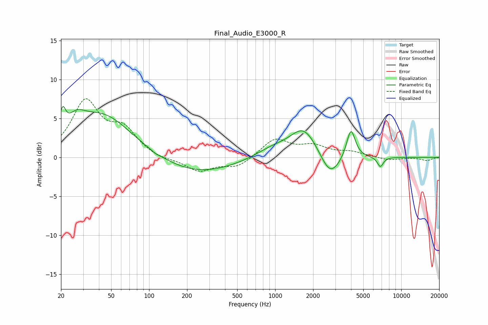

# Final_Audio_E3000_R
See [usage instructions](https://github.com/jaakkopasanen/AutoEq#usage) for more options and info.

### Parametric EQs
Apply preamp of -6.6 dB when using parametric equalizer.

|   # | Type    |   Fc (Hz) |    Q |   Gain (dB) |
|-----|---------|-----------|------|-------------|
|   1 | Peaking |        21 | 6    |         2.8 |
|   2 | Peaking |        26 | 2.07 |         1.9 |
|   3 | Peaking |        43 | 0.6  |         5.5 |
|   4 | Peaking |       113 | 5.91 |        -0.2 |
|   5 | Peaking |       236 | 0.46 |        -2.1 |
|   6 | Peaking |       948 | 1.03 |         1.1 |
|   7 | Peaking |      1690 | 1.3  |         3.8 |
|   8 | Peaking |      2730 | 1.81 |        -3.2 |
|   9 | Peaking |      3988 | 4.13 |         3.8 |
|  10 | Peaking |      6829 | 5.76 |        -1.3 |

### Fixed Band EQs
When using fixed band (also called graphic) equalizer, apply preamp of **-7.6 dB** (if available) and set gains manually with these parameters.

|   # | Type    |   Fc (Hz) |    Q |   Gain (dB) |
|-----|---------|-----------|------|-------------|
|   1 | Peaking |        31 | 1.41 |         7   |
|   2 | Peaking |        62 | 1.41 |         3.2 |
|   3 | Peaking |       125 | 1.41 |        -0.4 |
|   4 | Peaking |       250 | 1.41 |        -1.7 |
|   5 | Peaking |       500 | 1.41 |        -1.2 |
|   6 | Peaking |      1000 | 1.41 |         2.3 |
|   7 | Peaking |      2000 | 1.41 |         1.3 |
|   8 | Peaking |      4000 | 1.41 |         0.6 |
|   9 | Peaking |      8000 | 1.41 |        -0.4 |
|  10 | Peaking |     16000 | 1.41 |        -0.4 |

### Graphs

