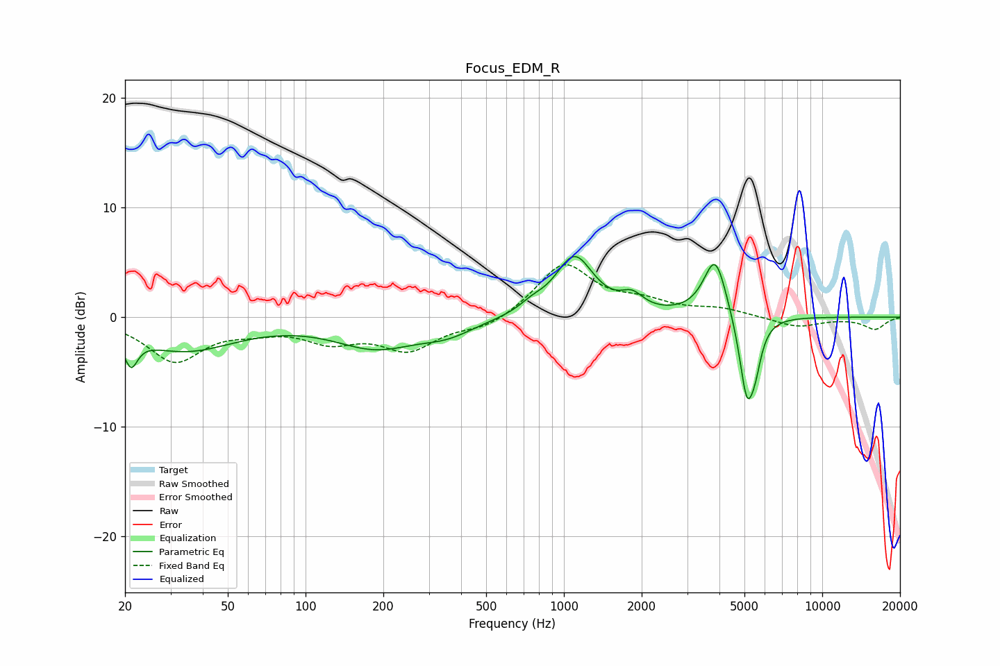

# Focus_EDM_R
See [usage instructions](https://github.com/jaakkopasanen/AutoEq#usage) for more options and info.

### Parametric EQs
Apply preamp of -5.6 dB when using parametric equalizer.

|   # | Type    |   Fc (Hz) |    Q |   Gain (dB) |
|-----|---------|-----------|------|-------------|
|   1 | Peaking |        21 | 5.62 |        -2.6 |
|   2 | Peaking |        34 | 0.72 |        -3   |
|   3 | Peaking |       188 | 0.88 |        -2.6 |
|   4 | Peaking |       354 | 1.35 |        -1.1 |
|   5 | Peaking |       752 | 2.89 |         0.7 |
|   6 | Peaking |      1098 | 1.92 |         5.5 |
|   7 | Peaking |      1837 | 3.32 |         1.3 |
|   8 | Peaking |      3852 | 3.15 |         5.6 |
|   9 | Peaking |      5112 | 4.63 |        -7.5 |
|  10 | Peaking |      5513 | 6    |        -2.2 |

### Fixed Band EQs
When using fixed band (also called graphic) equalizer, apply preamp of **-4.9 dB** (if available) and set gains manually with these parameters.

|   # | Type    |   Fc (Hz) |    Q |   Gain (dB) |
|-----|---------|-----------|------|-------------|
|   1 | Peaking |        31 | 1.41 |        -3.9 |
|   2 | Peaking |        62 | 1.41 |        -0.8 |
|   3 | Peaking |       125 | 1.41 |        -1.9 |
|   4 | Peaking |       250 | 1.41 |        -2.8 |
|   5 | Peaking |       500 | 1.41 |        -1   |
|   6 | Peaking |      1000 | 1.41 |         4.9 |
|   7 | Peaking |      2000 | 1.41 |         1.1 |
|   8 | Peaking |      4000 | 1.41 |         0.7 |
|   9 | Peaking |      8000 | 1.41 |        -0.9 |
|  10 | Peaking |     16000 | 1.41 |        -1.1 |

### Graphs

