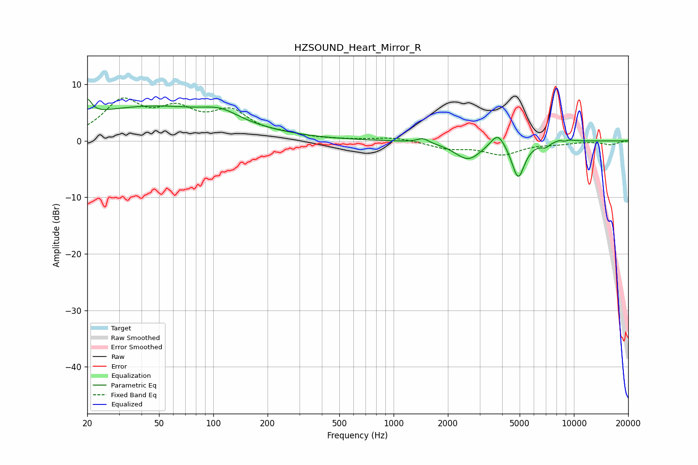

# HZSOUND_Heart_Mirror_R
See [usage instructions](https://github.com/jaakkopasanen/AutoEq#usage) for more options and info.

### Parametric EQs
Apply preamp of -7.5 dB when using parametric equalizer.

|   # | Type    |   Fc (Hz) |    Q |   Gain (dB) |
|-----|---------|-----------|------|-------------|
|   1 | Peaking |        20 | 5.95 |         2.9 |
|   2 | Peaking |        45 | 0.32 |         6   |
|   3 | Peaking |       110 | 1.49 |         1.6 |
|   4 | Peaking |      1456 | 4.71 |         0.8 |
|   5 | Peaking |      2592 | 1.91 |        -3.3 |
|   6 | Peaking |      3785 | 3.54 |         2.7 |
|   7 | Peaking |      4908 | 3.92 |        -6.5 |
|   8 | Peaking |      6956 | 6    |        -0.7 |
|   9 | Peaking |      8808 | 3.91 |         1.3 |
|  10 | Peaking |      8840 | 5.99 |        -1.1 |

### Fixed Band EQs
When using fixed band (also called graphic) equalizer, apply preamp of **-7.7 dB** (if available) and set gains manually with these parameters.

|   # | Type    |   Fc (Hz) |    Q |   Gain (dB) |
|-----|---------|-----------|------|-------------|
|   1 | Peaking |        31 | 1.41 |         6.5 |
|   2 | Peaking |        62 | 1.41 |         4.5 |
|   3 | Peaking |       125 | 1.41 |         4.6 |
|   4 | Peaking |       250 | 1.41 |         0.7 |
|   5 | Peaking |       500 | 1.41 |         0.1 |
|   6 | Peaking |      1000 | 1.41 |         0.6 |
|   7 | Peaking |      2000 | 1.41 |        -1.2 |
|   8 | Peaking |      4000 | 1.41 |        -2.3 |
|   9 | Peaking |      8000 | 1.41 |        -0.4 |
|  10 | Peaking |     16000 | 1.41 |        -0.7 |

### Graphs

