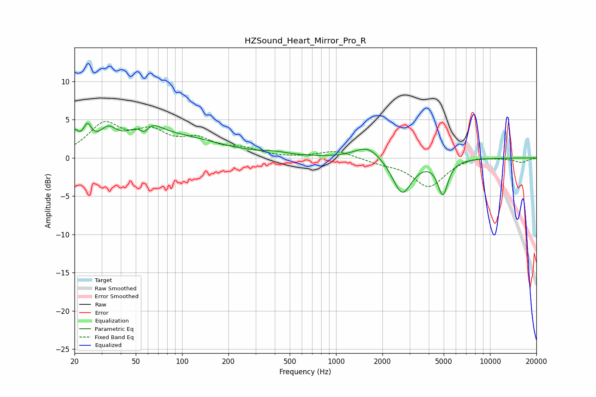

# HZSound_Heart_Mirror_Pro_R
See [usage instructions](https://github.com/jaakkopasanen/AutoEq#usage) for more options and info.

### Parametric EQs
Apply preamp of -4.6 dB when using parametric equalizer.

|   # | Type    |   Fc (Hz) |    Q |   Gain (dB) |
|-----|---------|-----------|------|-------------|
|   1 | Peaking |        20 | 5.78 |         2.2 |
|   2 | Peaking |        24 | 5.03 |         2.6 |
|   3 | Peaking |        33 | 2.58 |         2.3 |
|   4 | Peaking |        57 | 3.81 |        -2.5 |
|   5 | Peaking |        58 | 1.98 |         3.6 |
|   6 | Peaking |        90 | 0.49 |         2.6 |
|   7 | Peaking |       403 | 1.59 |         0.4 |
|   8 | Peaking |      1612 | 1.67 |         1.7 |
|   9 | Peaking |      2685 | 2.26 |        -4.8 |
|  10 | Peaking |      4936 | 4.25 |        -4.4 |

### Fixed Band EQs
When using fixed band (also called graphic) equalizer, apply preamp of **-4.8 dB** (if available) and set gains manually with these parameters.

|   # | Type    |   Fc (Hz) |    Q |   Gain (dB) |
|-----|---------|-----------|------|-------------|
|   1 | Peaking |        31 | 1.41 |         4.1 |
|   2 | Peaking |        62 | 1.41 |         2.9 |
|   3 | Peaking |       125 | 1.41 |         2.1 |
|   4 | Peaking |       250 | 1.41 |         1   |
|   5 | Peaking |       500 | 1.41 |        -0   |
|   6 | Peaking |      1000 | 1.41 |         1   |
|   7 | Peaking |      2000 | 1.41 |        -0.5 |
|   8 | Peaking |      4000 | 1.41 |        -3.7 |
|   9 | Peaking |      8000 | 1.41 |         0.4 |
|  10 | Peaking |     16000 | 1.41 |        -0.6 |

### Graphs

