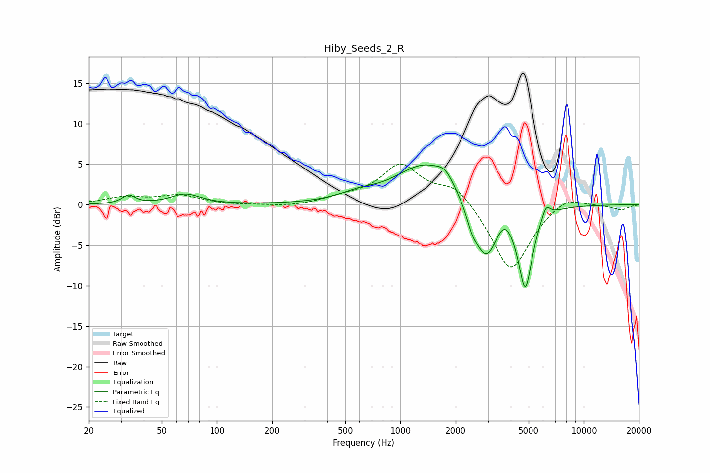

# Hiby_Seeds_2_R
See [usage instructions](https://github.com/jaakkopasanen/AutoEq#usage) for more options and info.

### Parametric EQs
Apply preamp of -5.0 dB when using parametric equalizer.

|   # | Type    |   Fc (Hz) |    Q |   Gain (dB) |
|-----|---------|-----------|------|-------------|
|   1 | Peaking |        33 | 4.25 |         1   |
|   2 | Peaking |        67 | 1.79 |         1.3 |
|   3 | Peaking |       589 | 1.39 |         0.8 |
|   4 | Peaking |      1388 | 0.87 |         5.1 |
|   5 | Peaking |      1755 | 3.39 |         1.2 |
|   6 | Peaking |      2466 | 4.72 |        -1.7 |
|   7 | Peaking |      2926 | 2.15 |        -7.1 |
|   8 | Peaking |      3684 | 3.43 |         1.5 |
|   9 | Peaking |      4795 | 3.58 |       -10   |
|  10 | Peaking |      6219 | 5.9  |         1.7 |

### Fixed Band EQs
When using fixed band (also called graphic) equalizer, apply preamp of **-5.1 dB** (if available) and set gains manually with these parameters.

|   # | Type    |   Fc (Hz) |    Q |   Gain (dB) |
|-----|---------|-----------|------|-------------|
|   1 | Peaking |        31 | 1.41 |         0.8 |
|   2 | Peaking |        62 | 1.41 |         1.1 |
|   3 | Peaking |       125 | 1.41 |        -0.1 |
|   4 | Peaking |       250 | 1.41 |        -0.3 |
|   5 | Peaking |       500 | 1.41 |         0.7 |
|   6 | Peaking |      1000 | 1.41 |         4.7 |
|   7 | Peaking |      2000 | 1.41 |         2.5 |
|   8 | Peaking |      4000 | 1.41 |        -8.5 |
|   9 | Peaking |      8000 | 1.41 |         1.4 |
|  10 | Peaking |     16000 | 1.41 |        -0.6 |

### Graphs

