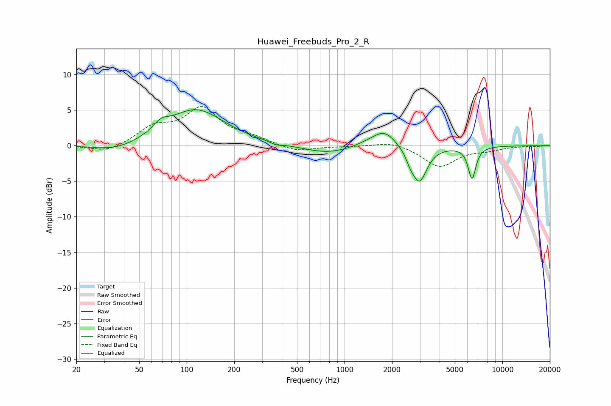

# Huawei_Freebuds_Pro_2_R
See [usage instructions](https://github.com/jaakkopasanen/AutoEq#usage) for more options and info.

### Parametric EQs
Apply preamp of -5.2 dB when using parametric equalizer.

|   # | Type    |   Fc (Hz) |    Q |   Gain (dB) |
|-----|---------|-----------|------|-------------|
|   1 | Peaking |        36 | 1.02 |        -1   |
|   2 | Peaking |        69 | 2.91 |         1.2 |
|   3 | Peaking |       114 | 0.79 |         5.1 |
|   4 | Peaking |       368 | 4.06 |        -0.4 |
|   5 | Peaking |       785 | 0.88 |        -1.2 |
|   6 | Peaking |      1431 | 1.47 |         0.5 |
|   7 | Peaking |      1798 | 1.94 |         2.2 |
|   8 | Peaking |      2614 | 5.36 |        -1   |
|   9 | Peaking |      2981 | 3    |        -5   |
|  10 | Peaking |      6421 | 5.65 |        -4.5 |

### Fixed Band EQs
When using fixed band (also called graphic) equalizer, apply preamp of **-5.6 dB** (if available) and set gains manually with these parameters.

|   # | Type    |   Fc (Hz) |    Q |   Gain (dB) |
|-----|---------|-----------|------|-------------|
|   1 | Peaking |        31 | 1.41 |        -1   |
|   2 | Peaking |        62 | 1.41 |         2.4 |
|   3 | Peaking |       125 | 1.41 |         5   |
|   4 | Peaking |       250 | 1.41 |         0.9 |
|   5 | Peaking |       500 | 1.41 |        -0.9 |
|   6 | Peaking |      1000 | 1.41 |        -0.1 |
|   7 | Peaking |      2000 | 1.41 |         0.7 |
|   8 | Peaking |      4000 | 1.41 |        -3   |
|   9 | Peaking |      8000 | 1.41 |        -0.5 |
|  10 | Peaking |     16000 | 1.41 |        -0.1 |

### Graphs

