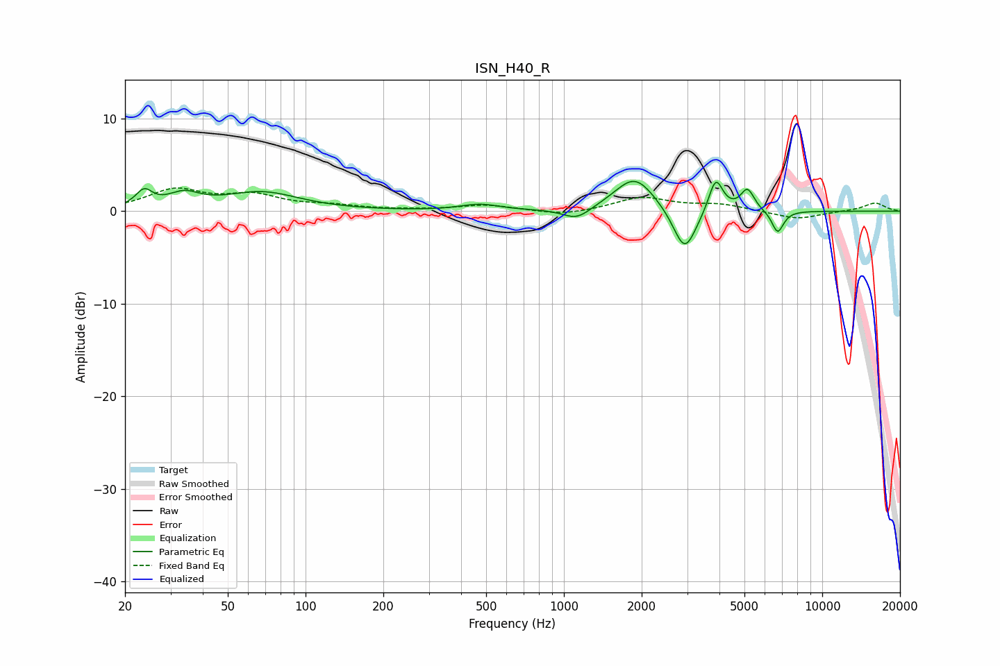

# ISN_H40_R
See [usage instructions](https://github.com/jaakkopasanen/AutoEq#usage) for more options and info.

### Parametric EQs
Apply preamp of -3.3 dB when using parametric equalizer.

|   # | Type    |   Fc (Hz) |    Q |   Gain (dB) |
|-----|---------|-----------|------|-------------|
|   1 | Peaking |        24 | 4.45 |         1.8 |
|   2 | Peaking |        34 | 2.33 |         1.5 |
|   3 | Peaking |        68 | 0.97 |         2   |
|   4 | Peaking |       473 | 1.87 |         0.7 |
|   5 | Peaking |      1121 | 2.63 |        -1.3 |
|   6 | Peaking |      1880 | 1.81 |         3.8 |
|   7 | Peaking |      2937 | 3.15 |        -4.9 |
|   8 | Peaking |      3870 | 5.13 |         3.7 |
|   9 | Peaking |      5135 | 5.31 |         2.3 |
|  10 | Peaking |      6723 | 6    |        -2.4 |

### Fixed Band EQs
When using fixed band (also called graphic) equalizer, apply preamp of **-2.6 dB** (if available) and set gains manually with these parameters.

|   # | Type    |   Fc (Hz) |    Q |   Gain (dB) |
|-----|---------|-----------|------|-------------|
|   1 | Peaking |        31 | 1.41 |         2.2 |
|   2 | Peaking |        62 | 1.41 |         1.5 |
|   3 | Peaking |       125 | 1.41 |         0.5 |
|   4 | Peaking |       250 | 1.41 |         0.1 |
|   5 | Peaking |       500 | 1.41 |         0.7 |
|   6 | Peaking |      1000 | 1.41 |        -0.5 |
|   7 | Peaking |      2000 | 1.41 |         1.5 |
|   8 | Peaking |      4000 | 1.41 |         0.7 |
|   9 | Peaking |      8000 | 1.41 |        -0.9 |
|  10 | Peaking |     16000 | 1.41 |         0.9 |

### Graphs

