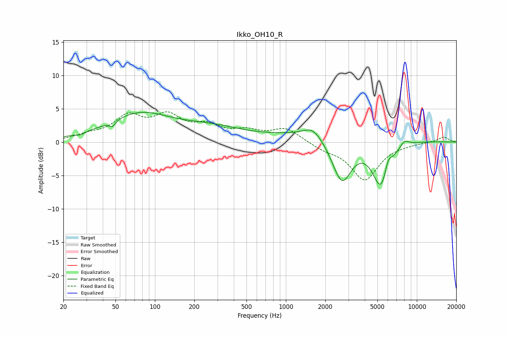

# Ikko_OH10_R
See [usage instructions](https://github.com/jaakkopasanen/AutoEq#usage) for more options and info.

### Parametric EQs
Apply preamp of -4.5 dB when using parametric equalizer.

|   # | Type    |   Fc (Hz) |    Q |   Gain (dB) |
|-----|---------|-----------|------|-------------|
|   1 | Peaking |        27 | 5.75 |        -0.3 |
|   2 | Peaking |        47 | 5.99 |        -0.8 |
|   3 | Peaking |        76 | 0.58 |         4   |
|   4 | Peaking |       270 | 0.59 |         1.7 |
|   5 | Peaking |      1602 | 1.96 |         1.7 |
|   6 | Peaking |      2355 | 0.3  |         1.5 |
|   7 | Peaking |      2678 | 1.83 |        -6.9 |
|   8 | Peaking |      5353 | 2.04 |        -7.4 |
|   9 | Peaking |      6018 | 4.97 |         2.2 |
|  10 | Peaking |      8047 | 3.89 |         1   |

### Fixed Band EQs
When using fixed band (also called graphic) equalizer, apply preamp of **-4.6 dB** (if available) and set gains manually with these parameters.

|   # | Type    |   Fc (Hz) |    Q |   Gain (dB) |
|-----|---------|-----------|------|-------------|
|   1 | Peaking |        31 | 1.41 |         0.8 |
|   2 | Peaking |        62 | 1.41 |         3.5 |
|   3 | Peaking |       125 | 1.41 |         3.4 |
|   4 | Peaking |       250 | 1.41 |         2   |
|   5 | Peaking |       500 | 1.41 |         1.3 |
|   6 | Peaking |      1000 | 1.41 |         2   |
|   7 | Peaking |      2000 | 1.41 |        -0.9 |
|   8 | Peaking |      4000 | 1.41 |        -5.6 |
|   9 | Peaking |      8000 | 1.41 |        -0.2 |
|  10 | Peaking |     16000 | 1.41 |         0.8 |

### Graphs

