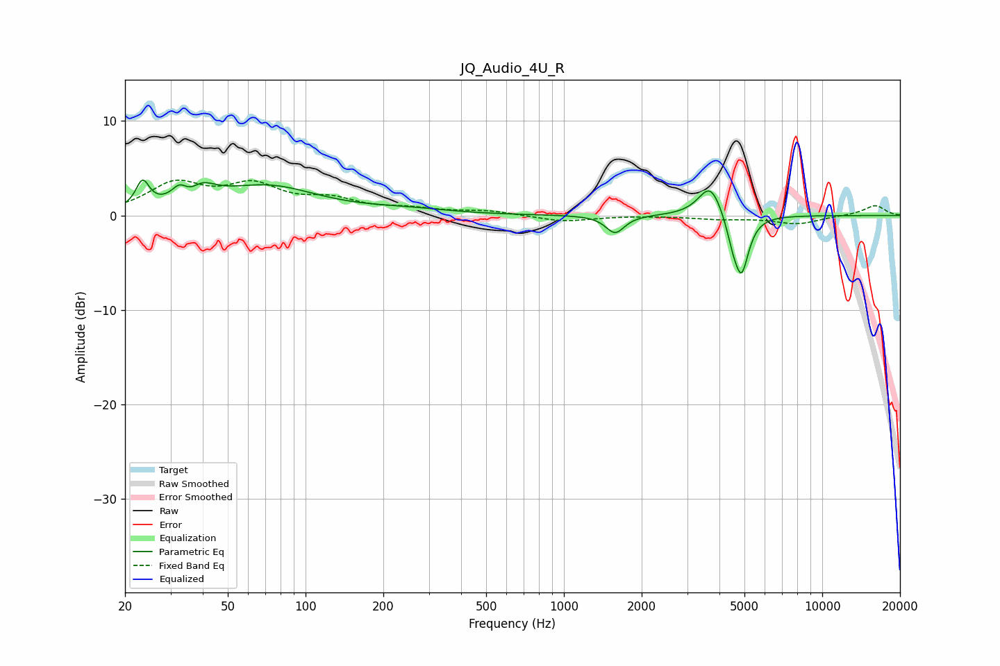

# JQ_Audio_4U_R
See [usage instructions](https://github.com/jaakkopasanen/AutoEq#usage) for more options and info.

### Parametric EQs
Apply preamp of -3.9 dB when using parametric equalizer.

|   # | Type    |   Fc (Hz) |    Q |   Gain (dB) |
|-----|---------|-----------|------|-------------|
|   1 | Peaking |        23 | 5.6  |         2.8 |
|   2 | Peaking |        32 | 5.67 |         0.9 |
|   3 | Peaking |        36 | 3.57 |        -2.1 |
|   4 | Peaking |        37 | 2.51 |         3.4 |
|   5 | Peaking |        71 | 0.74 |         3   |
|   6 | Peaking |       248 | 0.86 |         0.5 |
|   7 | Peaking |      1578 | 3.97 |        -1.9 |
|   8 | Peaking |      3688 | 3.1  |         3.5 |
|   9 | Peaking |      4490 | 5.99 |        -1.7 |
|  10 | Peaking |      4867 | 4.91 |        -6   |

### Fixed Band EQs
When using fixed band (also called graphic) equalizer, apply preamp of **-3.8 dB** (if available) and set gains manually with these parameters.

|   # | Type    |   Fc (Hz) |    Q |   Gain (dB) |
|-----|---------|-----------|------|-------------|
|   1 | Peaking |        31 | 1.41 |         3.1 |
|   2 | Peaking |        62 | 1.41 |         2.8 |
|   3 | Peaking |       125 | 1.41 |         1.4 |
|   4 | Peaking |       250 | 1.41 |         0.6 |
|   5 | Peaking |       500 | 1.41 |         0.4 |
|   6 | Peaking |      1000 | 1.41 |        -0.6 |
|   7 | Peaking |      2000 | 1.41 |         0   |
|   8 | Peaking |      4000 | 1.41 |        -0.3 |
|   9 | Peaking |      8000 | 1.41 |        -0.9 |
|  10 | Peaking |     16000 | 1.41 |         1.1 |

### Graphs

