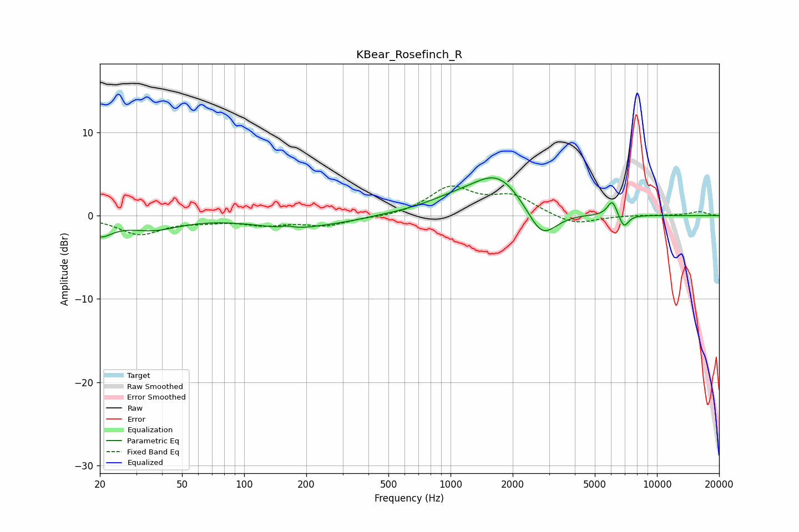

# KBear_Rosefinch_R
See [usage instructions](https://github.com/jaakkopasanen/AutoEq#usage) for more options and info.

### Parametric EQs
Apply preamp of -4.6 dB when using parametric equalizer.

|   # | Type    |   Fc (Hz) |    Q |   Gain (dB) |
|-----|---------|-----------|------|-------------|
|   1 | Peaking |        20 | 2.34 |        -2   |
|   2 | Peaking |        36 | 1.09 |        -1.5 |
|   3 | Peaking |       163 | 5.75 |         0.3 |
|   4 | Peaking |       173 | 0.77 |        -1.4 |
|   5 | Peaking |       316 | 1.34 |        -0.2 |
|   6 | Peaking |      1019 | 0.92 |         1.2 |
|   7 | Peaking |      1706 | 1.1  |         4.6 |
|   8 | Peaking |      2767 | 1.94 |        -3.9 |
|   9 | Peaking |      6072 | 6    |         1.9 |
|  10 | Peaking |      6918 | 5.97 |        -1.6 |

### Fixed Band EQs
When using fixed band (also called graphic) equalizer, apply preamp of **-3.7 dB** (if available) and set gains manually with these parameters.

|   # | Type    |   Fc (Hz) |    Q |   Gain (dB) |
|-----|---------|-----------|------|-------------|
|   1 | Peaking |        31 | 1.41 |        -2.2 |
|   2 | Peaking |        62 | 1.41 |        -0.5 |
|   3 | Peaking |       125 | 1.41 |        -0.9 |
|   4 | Peaking |       250 | 1.41 |        -1.1 |
|   5 | Peaking |       500 | 1.41 |        -0.2 |
|   6 | Peaking |      1000 | 1.41 |         3.3 |
|   7 | Peaking |      2000 | 1.41 |         2.2 |
|   8 | Peaking |      4000 | 1.41 |        -1.2 |
|   9 | Peaking |      8000 | 1.41 |         0.1 |
|  10 | Peaking |     16000 | 1.41 |         0.5 |

### Graphs

