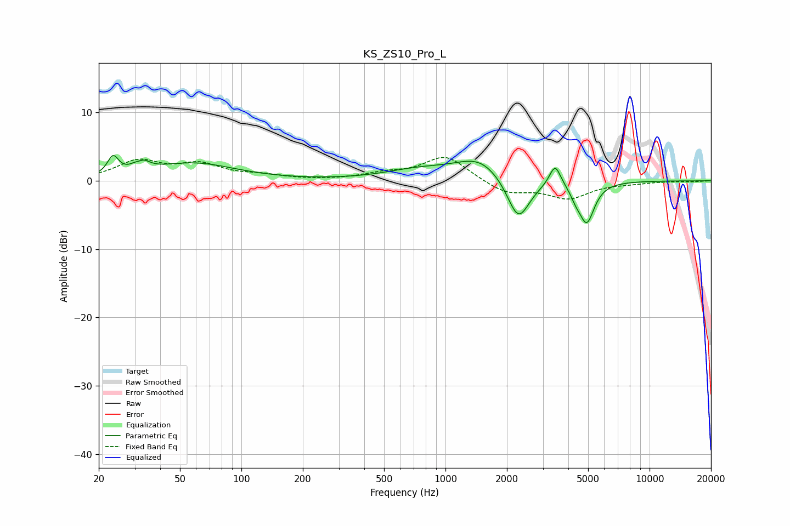

# KS_ZS10_Pro_L
See [usage instructions](https://github.com/jaakkopasanen/AutoEq#usage) for more options and info.

### Parametric EQs
Apply preamp of -3.8 dB when using parametric equalizer.

|   # | Type    |   Fc (Hz) |    Q |   Gain (dB) |
|-----|---------|-----------|------|-------------|
|   1 | Peaking |        24 | 5.41 |         2.6 |
|   2 | Peaking |        32 | 5.99 |        -1.6 |
|   3 | Peaking |        32 | 4.47 |         2.9 |
|   4 | Peaking |        58 | 0.69 |         2.5 |
|   5 | Peaking |       744 | 0.84 |         1.4 |
|   6 | Peaking |      1478 | 1.19 |         3.1 |
|   7 | Peaking |      2274 | 2.5  |        -6.5 |
|   8 | Peaking |      3445 | 5.12 |         3.2 |
|   9 | Peaking |      4341 | 5.91 |        -1.1 |
|  10 | Peaking |      4919 | 3.71 |        -6   |

### Fixed Band EQs
When using fixed band (also called graphic) equalizer, apply preamp of **-3.5 dB** (if available) and set gains manually with these parameters.

|   # | Type    |   Fc (Hz) |    Q |   Gain (dB) |
|-----|---------|-----------|------|-------------|
|   1 | Peaking |        31 | 1.41 |         2.7 |
|   2 | Peaking |        62 | 1.41 |         2.2 |
|   3 | Peaking |       125 | 1.41 |         0.6 |
|   4 | Peaking |       250 | 1.41 |        -0   |
|   5 | Peaking |       500 | 1.41 |         0.9 |
|   6 | Peaking |      1000 | 1.41 |         3.6 |
|   7 | Peaking |      2000 | 1.41 |        -1.9 |
|   8 | Peaking |      4000 | 1.41 |        -2.4 |
|   9 | Peaking |      8000 | 1.41 |        -0.3 |
|  10 | Peaking |     16000 | 1.41 |        -0.1 |

### Graphs

