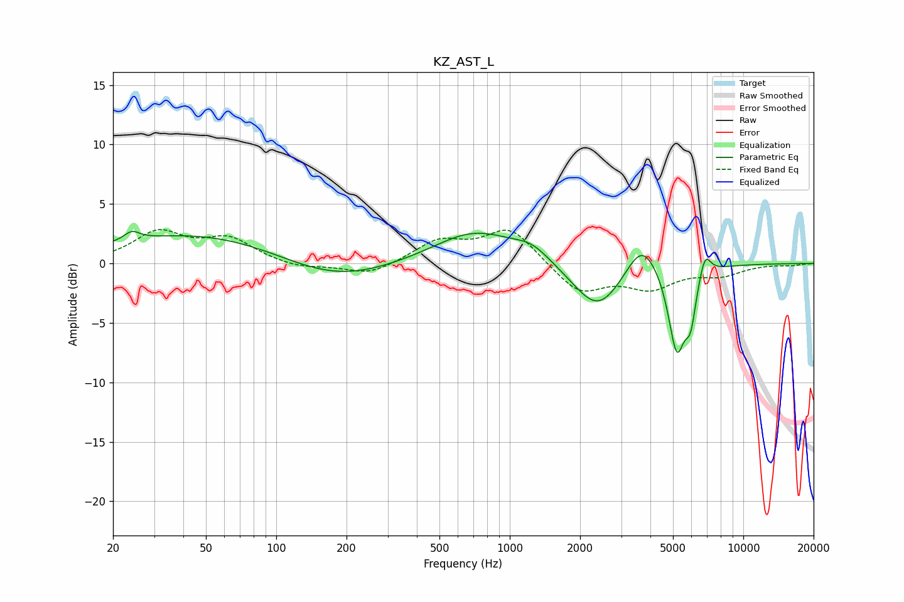

# KZ_AST_L
See [usage instructions](https://github.com/jaakkopasanen/AutoEq#usage) for more options and info.

### Parametric EQs
Apply preamp of -2.8 dB when using parametric equalizer.

|   # | Type    |   Fc (Hz) |    Q |   Gain (dB) |
|-----|---------|-----------|------|-------------|
|   1 | Peaking |        24 | 4.33 |         0.8 |
|   2 | Peaking |        48 | 0.35 |         2.6 |
|   3 | Peaking |       172 | 0.58 |        -2   |
|   4 | Peaking |       712 | 0.77 |         2.8 |
|   5 | Peaking |      1244 | 1.9  |         1   |
|   6 | Peaking |      2382 | 1.33 |        -4.1 |
|   7 | Peaking |      3682 | 2.07 |         3   |
|   8 | Peaking |      5190 | 3.83 |        -7.2 |
|   9 | Peaking |      5949 | 5.98 |        -3.3 |
|  10 | Peaking |      6856 | 5.61 |         2   |

### Fixed Band EQs
When using fixed band (also called graphic) equalizer, apply preamp of **-2.9 dB** (if available) and set gains manually with these parameters.

|   # | Type    |   Fc (Hz) |    Q |   Gain (dB) |
|-----|---------|-----------|------|-------------|
|   1 | Peaking |        31 | 1.41 |         2.5 |
|   2 | Peaking |        62 | 1.41 |         1.9 |
|   3 | Peaking |       125 | 1.41 |        -0.5 |
|   4 | Peaking |       250 | 1.41 |        -1   |
|   5 | Peaking |       500 | 1.41 |         1.8 |
|   6 | Peaking |      1000 | 1.41 |         3   |
|   7 | Peaking |      2000 | 1.41 |        -2.5 |
|   8 | Peaking |      4000 | 1.41 |        -1.9 |
|   9 | Peaking |      8000 | 1.41 |        -0.9 |
|  10 | Peaking |     16000 | 1.41 |        -0.1 |

### Graphs

