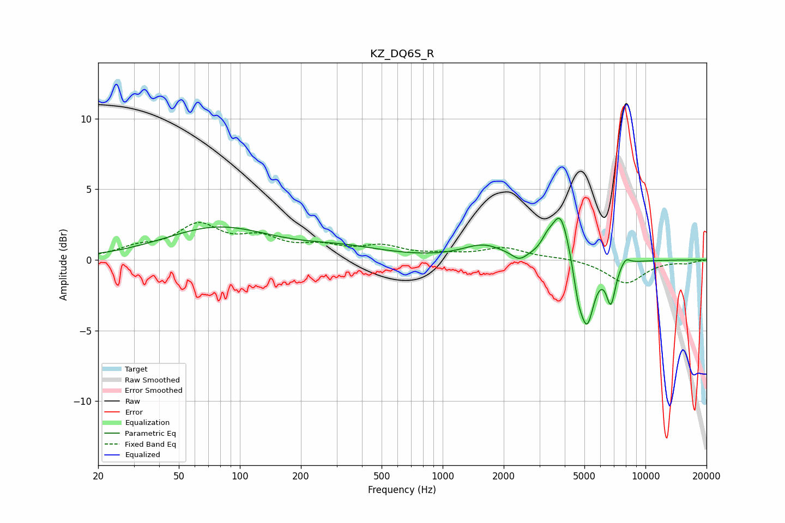

# KZ_DQ6S_R
See [usage instructions](https://github.com/jaakkopasanen/AutoEq#usage) for more options and info.

### Parametric EQs
Apply preamp of -3.1 dB when using parametric equalizer.

|   # | Type    |   Fc (Hz) |    Q |   Gain (dB) |
|-----|---------|-----------|------|-------------|
|   1 | Peaking |        78 | 0.54 |         2.2 |
|   2 | Peaking |       325 | 0.68 |         0.7 |
|   3 | Peaking |      1581 | 1.4  |         1   |
|   4 | Peaking |      2387 | 3.96 |        -0.6 |
|   5 | Peaking |      3275 | 4.98 |         0.7 |
|   6 | Peaking |      3813 | 3.23 |         3.5 |
|   7 | Peaking |      4651 | 6    |        -1.6 |
|   8 | Peaking |      5147 | 3.9  |        -4.5 |
|   9 | Peaking |      6754 | 5.99 |        -2.7 |
|  10 | Peaking |      7977 | 5.71 |         0.5 |

### Fixed Band EQs
When using fixed band (also called graphic) equalizer, apply preamp of **-2.8 dB** (if available) and set gains manually with these parameters.

|   # | Type    |   Fc (Hz) |    Q |   Gain (dB) |
|-----|---------|-----------|------|-------------|
|   1 | Peaking |        31 | 1.41 |         0.7 |
|   2 | Peaking |        62 | 1.41 |         2.2 |
|   3 | Peaking |       125 | 1.41 |         1.3 |
|   4 | Peaking |       250 | 1.41 |         0.8 |
|   5 | Peaking |       500 | 1.41 |         0.8 |
|   6 | Peaking |      1000 | 1.41 |         0.3 |
|   7 | Peaking |      2000 | 1.41 |         0.8 |
|   8 | Peaking |      4000 | 1.41 |         0.2 |
|   9 | Peaking |      8000 | 1.41 |        -1.7 |
|  10 | Peaking |     16000 | 1.41 |        -0.2 |

### Graphs

