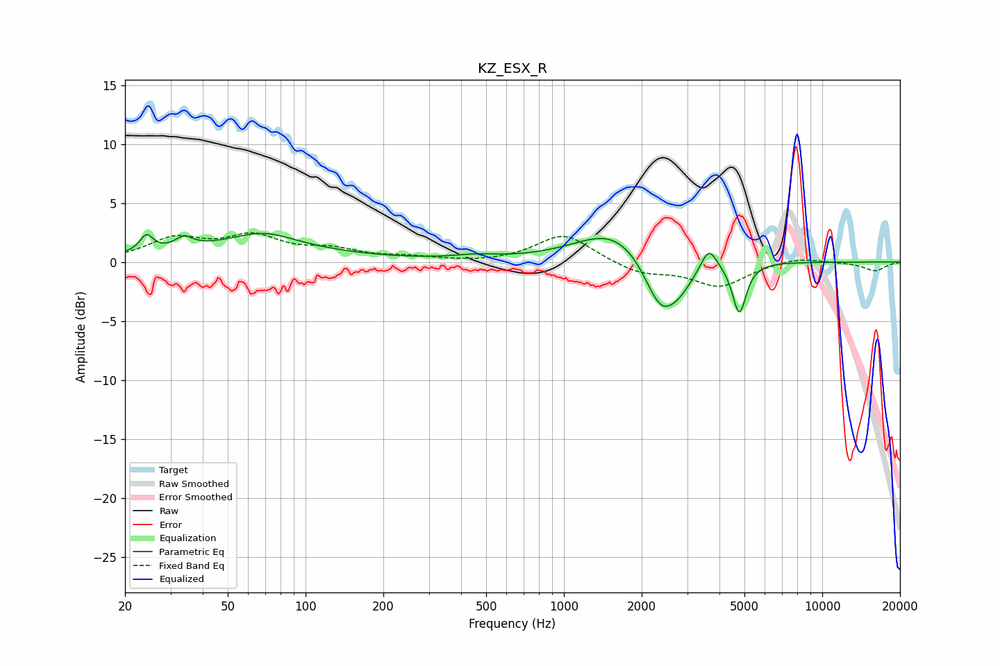

# KZ_ESX_R
See [usage instructions](https://github.com/jaakkopasanen/AutoEq#usage) for more options and info.

### Parametric EQs
Apply preamp of -2.5 dB when using parametric equalizer.

|   # | Type    |   Fc (Hz) |    Q |   Gain (dB) |
|-----|---------|-----------|------|-------------|
|   1 | Peaking |        24 | 5.78 |         1.4 |
|   2 | Peaking |        34 | 4.34 |         0.9 |
|   3 | Peaking |        58 | 0.4  |         1.2 |
|   4 | Peaking |        69 | 1.21 |         1.2 |
|   5 | Peaking |       455 | 1.59 |         0.3 |
|   6 | Peaking |      1581 | 0.96 |         2.9 |
|   7 | Peaking |      2365 | 2.16 |        -4.5 |
|   8 | Peaking |      2802 | 2.41 |        -1.6 |
|   9 | Peaking |      3639 | 4.63 |         2   |
|  10 | Peaking |      4778 | 5.4  |        -4.3 |

### Fixed Band EQs
When using fixed band (also called graphic) equalizer, apply preamp of **-2.6 dB** (if available) and set gains manually with these parameters.

|   # | Type    |   Fc (Hz) |    Q |   Gain (dB) |
|-----|---------|-----------|------|-------------|
|   1 | Peaking |        31 | 1.41 |         1.8 |
|   2 | Peaking |        62 | 1.41 |         2   |
|   3 | Peaking |       125 | 1.41 |         0.9 |
|   4 | Peaking |       250 | 1.41 |         0.3 |
|   5 | Peaking |       500 | 1.41 |        -0.1 |
|   6 | Peaking |      1000 | 1.41 |         2.4 |
|   7 | Peaking |      2000 | 1.41 |        -1   |
|   8 | Peaking |      4000 | 1.41 |        -2   |
|   9 | Peaking |      8000 | 1.41 |         0.5 |
|  10 | Peaking |     16000 | 1.41 |        -0.7 |

### Graphs

