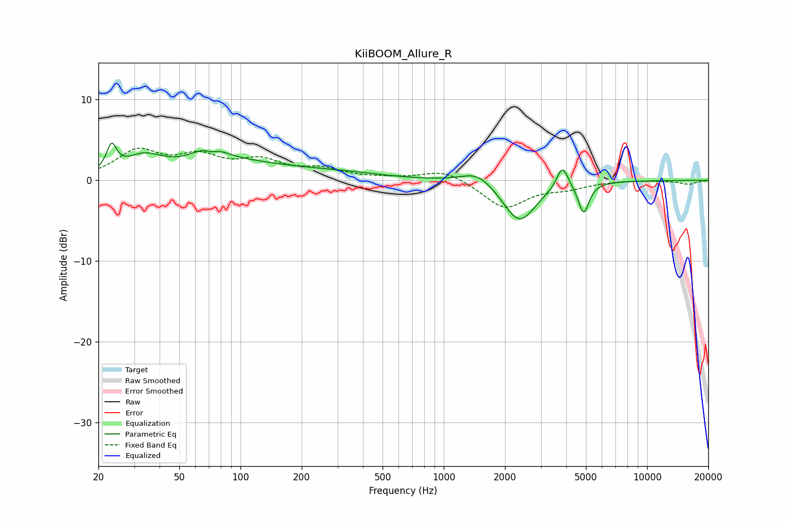

# KiiBOOM_Allure_R
See [usage instructions](https://github.com/jaakkopasanen/AutoEq#usage) for more options and info.

### Parametric EQs
Apply preamp of -4.7 dB when using parametric equalizer.

|   # | Type    |   Fc (Hz) |    Q |   Gain (dB) |
|-----|---------|-----------|------|-------------|
|   1 | Peaking |        23 | 5.93 |         3.1 |
|   2 | Peaking |        33 | 1.54 |         2.2 |
|   3 | Peaking |        71 | 2.26 |         3.3 |
|   4 | Peaking |        71 | 3.38 |        -2   |
|   5 | Peaking |        94 | 0.48 |         2   |
|   6 | Peaking |       322 | 0.71 |         0.6 |
|   7 | Peaking |      1466 | 1.8  |         1.6 |
|   8 | Peaking |      2354 | 1.75 |        -5.2 |
|   9 | Peaking |      3833 | 5.03 |         2.9 |
|  10 | Peaking |      4877 | 5.37 |        -3.8 |

### Fixed Band EQs
When using fixed band (also called graphic) equalizer, apply preamp of **-4.1 dB** (if available) and set gains manually with these parameters.

|   # | Type    |   Fc (Hz) |    Q |   Gain (dB) |
|-----|---------|-----------|------|-------------|
|   1 | Peaking |        31 | 1.41 |         3.4 |
|   2 | Peaking |        62 | 1.41 |         2.5 |
|   3 | Peaking |       125 | 1.41 |         2.1 |
|   4 | Peaking |       250 | 1.41 |         1.2 |
|   5 | Peaking |       500 | 1.41 |         0.2 |
|   6 | Peaking |      1000 | 1.41 |         1.3 |
|   7 | Peaking |      2000 | 1.41 |        -3.4 |
|   8 | Peaking |      4000 | 1.41 |        -0.8 |
|   9 | Peaking |      8000 | 1.41 |         0.1 |
|  10 | Peaking |     16000 | 1.41 |        -0.5 |

### Graphs

