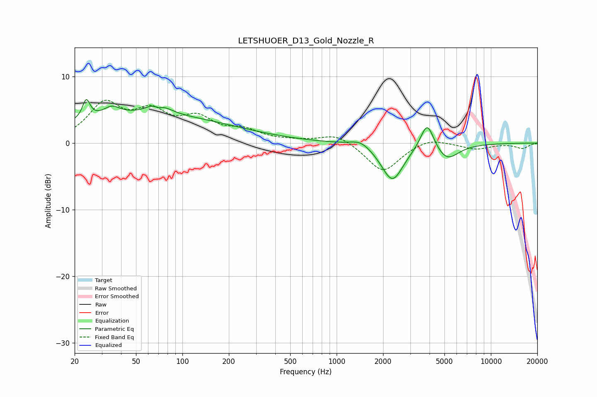

# LETSHUOER_D13_Gold_Nozzle_R
See [usage instructions](https://github.com/jaakkopasanen/AutoEq#usage) for more options and info.

### Parametric EQs
Apply preamp of -6.6 dB when using parametric equalizer.

|   # | Type    |   Fc (Hz) |    Q |   Gain (dB) |
|-----|---------|-----------|------|-------------|
|   1 | Peaking |        24 | 6    |         2.9 |
|   2 | Peaking |        35 | 2.71 |         1.4 |
|   3 | Peaking |        54 | 0.24 |         3.6 |
|   4 | Peaking |        70 | 2.85 |         4.9 |
|   5 | Peaking |        70 | 3.6  |        -3.8 |
|   6 | Peaking |        96 | 0.21 |         0.6 |
|   7 | Peaking |      1430 | 2.22 |         1   |
|   8 | Peaking |      2297 | 1.97 |        -5.7 |
|   9 | Peaking |      3865 | 3.29 |         4.2 |
|  10 | Peaking |      5187 | 1.88 |        -2.4 |

### Fixed Band EQs
When using fixed band (also called graphic) equalizer, apply preamp of **-6.5 dB** (if available) and set gains manually with these parameters.

|   # | Type    |   Fc (Hz) |    Q |   Gain (dB) |
|-----|---------|-----------|------|-------------|
|   1 | Peaking |        31 | 1.41 |         5.5 |
|   2 | Peaking |        62 | 1.41 |         4   |
|   3 | Peaking |       125 | 1.41 |         3.2 |
|   4 | Peaking |       250 | 1.41 |         1.6 |
|   5 | Peaking |       500 | 1.41 |         0.2 |
|   6 | Peaking |      1000 | 1.41 |         1.5 |
|   7 | Peaking |      2000 | 1.41 |        -4.4 |
|   8 | Peaking |      4000 | 1.41 |         0.9 |
|   9 | Peaking |      8000 | 1.41 |        -0.9 |
|  10 | Peaking |     16000 | 1.41 |        -0.8 |

### Graphs

