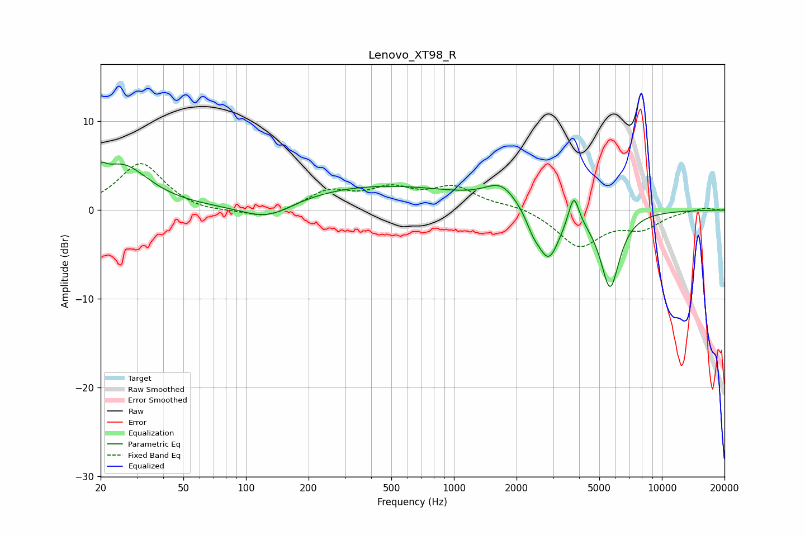

# Lenovo_XT98_R
See [usage instructions](https://github.com/jaakkopasanen/AutoEq#usage) for more options and info.

### Parametric EQs
Apply preamp of -5.5 dB when using parametric equalizer.

|   # | Type    |   Fc (Hz) |    Q |   Gain (dB) |
|-----|---------|-----------|------|-------------|
|   1 | Peaking |        20 | 5.85 |         1.3 |
|   2 | Peaking |        25 | 1.08 |         5   |
|   3 | Peaking |       127 | 1.11 |        -2   |
|   4 | Peaking |       430 | 0.33 |         2.8 |
|   5 | Peaking |      1691 | 1.82 |         2.4 |
|   6 | Peaking |      2395 | 4.35 |        -1.3 |
|   7 | Peaking |      2845 | 2.57 |        -5.7 |
|   8 | Peaking |      3733 | 4.35 |         0.3 |
|   9 | Peaking |      3771 | 5.77 |         3.3 |
|  10 | Peaking |      5633 | 2.99 |        -8.6 |

### Fixed Band EQs
When using fixed band (also called graphic) equalizer, apply preamp of **-5.3 dB** (if available) and set gains manually with these parameters.

|   # | Type    |   Fc (Hz) |    Q |   Gain (dB) |
|-----|---------|-----------|------|-------------|
|   1 | Peaking |        31 | 1.41 |         5.3 |
|   2 | Peaking |        62 | 1.41 |        -0.4 |
|   3 | Peaking |       125 | 1.41 |        -1.1 |
|   4 | Peaking |       250 | 1.41 |         2   |
|   5 | Peaking |       500 | 1.41 |         2.1 |
|   6 | Peaking |      1000 | 1.41 |         2.4 |
|   7 | Peaking |      2000 | 1.41 |         0.5 |
|   8 | Peaking |      4000 | 1.41 |        -4   |
|   9 | Peaking |      8000 | 1.41 |        -1.8 |
|  10 | Peaking |     16000 | 1.41 |         0.3 |

### Graphs

