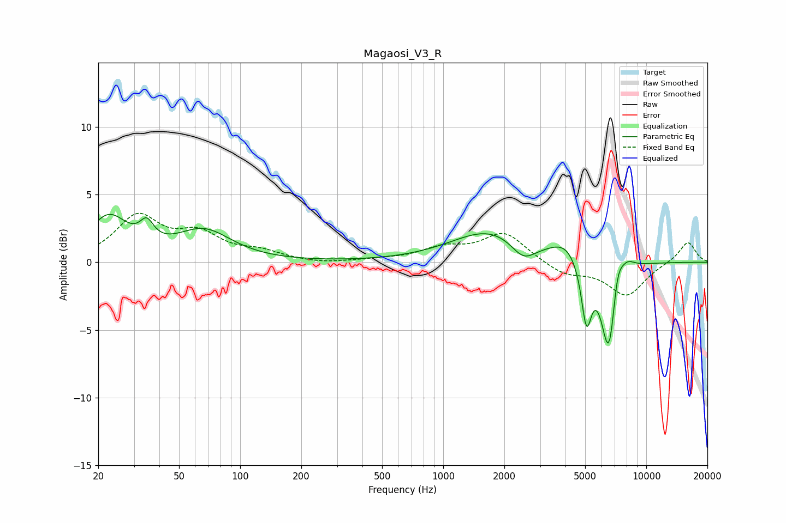

# Magaosi_V3_R
See [usage instructions](https://github.com/jaakkopasanen/AutoEq#usage) for more options and info.

### Parametric EQs
Apply preamp of -3.6 dB when using parametric equalizer.

|   # | Type    |   Fc (Hz) |    Q |   Gain (dB) |
|-----|---------|-----------|------|-------------|
|   1 | Peaking |        22 | 1.5  |         3.2 |
|   2 | Peaking |        35 | 4.28 |         1.4 |
|   3 | Peaking |        66 | 1.05 |         2.2 |
|   4 | Peaking |      1709 | 0.75 |         2.3 |
|   5 | Peaking |      2482 | 2.32 |        -1.4 |
|   6 | Peaking |      4010 | 1.89 |         1.2 |
|   7 | Peaking |      5075 | 5.56 |        -4.5 |
|   8 | Peaking |      6564 | 3.55 |        -7.4 |
|   9 | Peaking |      7173 | 4.8  |         2.6 |
|  10 | Peaking |      8034 | 3.43 |         0.9 |

### Fixed Band EQs
When using fixed band (also called graphic) equalizer, apply preamp of **-3.7 dB** (if available) and set gains manually with these parameters.

|   # | Type    |   Fc (Hz) |    Q |   Gain (dB) |
|-----|---------|-----------|------|-------------|
|   1 | Peaking |        31 | 1.41 |         3.3 |
|   2 | Peaking |        62 | 1.41 |         1.8 |
|   3 | Peaking |       125 | 1.41 |         0.6 |
|   4 | Peaking |       250 | 1.41 |        -0.2 |
|   5 | Peaking |       500 | 1.41 |         0.1 |
|   6 | Peaking |      1000 | 1.41 |         0.9 |
|   7 | Peaking |      2000 | 1.41 |         2.2 |
|   8 | Peaking |      4000 | 1.41 |        -0.9 |
|   9 | Peaking |      8000 | 1.41 |        -2.4 |
|  10 | Peaking |     16000 | 1.41 |         1.6 |

### Graphs

