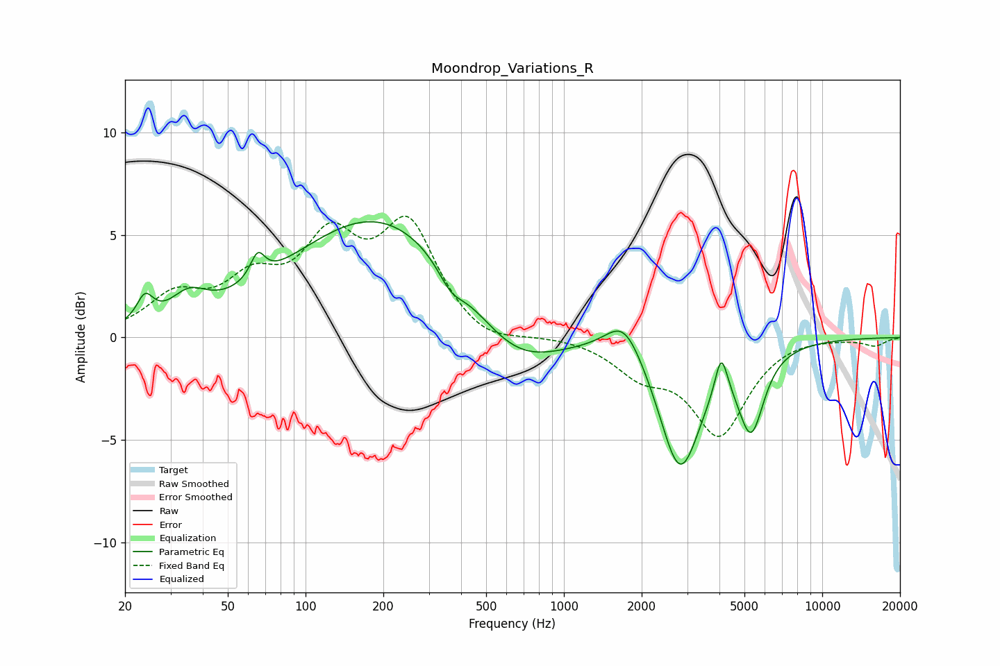

# Moondrop_Variations_R
See [usage instructions](https://github.com/jaakkopasanen/AutoEq#usage) for more options and info.

### Parametric EQs
Apply preamp of -5.8 dB when using parametric equalizer.

|   # | Type    |   Fc (Hz) |    Q |   Gain (dB) |
|-----|---------|-----------|------|-------------|
|   1 | Peaking |        24 | 4.51 |         1.3 |
|   2 | Peaking |        35 | 2.03 |         1.2 |
|   3 | Peaking |        65 | 5.06 |         1.3 |
|   4 | Peaking |       198 | 0.41 |         6.1 |
|   5 | Peaking |       365 | 2.85 |        -0.9 |
|   6 | Peaking |       635 | 0.79 |        -2.8 |
|   7 | Peaking |      1712 | 1.99 |         1.9 |
|   8 | Peaking |      2816 | 1.76 |        -6.3 |
|   9 | Peaking |      4065 | 5.92 |         2   |
|  10 | Peaking |      5304 | 2.79 |        -3.9 |

### Fixed Band EQs
When using fixed band (also called graphic) equalizer, apply preamp of **-6.0 dB** (if available) and set gains manually with these parameters.

|   # | Type    |   Fc (Hz) |    Q |   Gain (dB) |
|-----|---------|-----------|------|-------------|
|   1 | Peaking |        31 | 1.41 |         1.8 |
|   2 | Peaking |        62 | 1.41 |         2.3 |
|   3 | Peaking |       125 | 1.41 |         4.2 |
|   4 | Peaking |       250 | 1.41 |         5.1 |
|   5 | Peaking |       500 | 1.41 |        -0.6 |
|   6 | Peaking |      1000 | 1.41 |         0.1 |
|   7 | Peaking |      2000 | 1.41 |        -1.5 |
|   8 | Peaking |      4000 | 1.41 |        -4.6 |
|   9 | Peaking |      8000 | 1.41 |         0.1 |
|  10 | Peaking |     16000 | 1.41 |        -0.4 |

### Graphs

