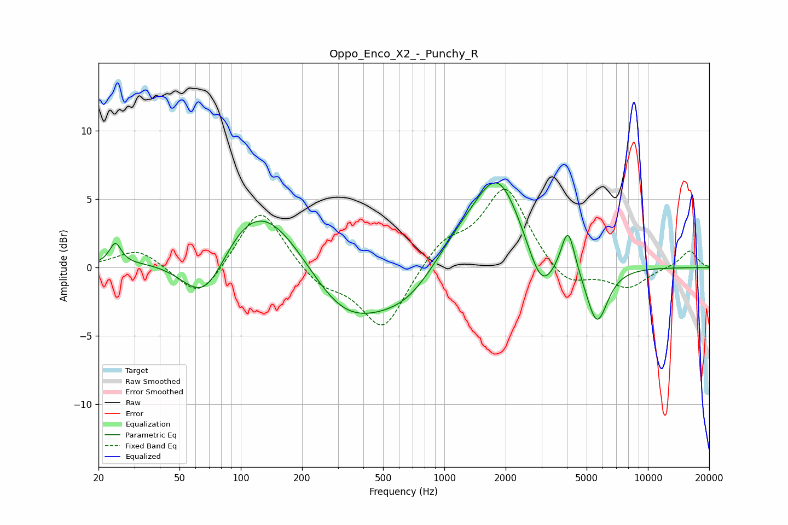

# Oppo_Enco_X2_-_Punchy_R
See [usage instructions](https://github.com/jaakkopasanen/AutoEq#usage) for more options and info.

### Parametric EQs
Apply preamp of -6.3 dB when using parametric equalizer.

|   # | Type    |   Fc (Hz) |    Q |   Gain (dB) |
|-----|---------|-----------|------|-------------|
|   1 | Peaking |        24 | 5.06 |         1.5 |
|   2 | Peaking |        67 | 1.09 |        -5.8 |
|   3 | Peaking |       115 | 0.54 |         7   |
|   4 | Peaking |       316 | 0.68 |        -4.9 |
|   5 | Peaking |       661 | 0.89 |        -2   |
|   6 | Peaking |      1172 | 0.96 |         1.8 |
|   7 | Peaking |      1839 | 1.18 |         6.3 |
|   8 | Peaking |      2997 | 2.1  |        -3.3 |
|   9 | Peaking |      4049 | 4.24 |         3.3 |
|  10 | Peaking |      5614 | 2.59 |        -4.3 |

### Fixed Band EQs
When using fixed band (also called graphic) equalizer, apply preamp of **-5.8 dB** (if available) and set gains manually with these parameters.

|   # | Type    |   Fc (Hz) |    Q |   Gain (dB) |
|-----|---------|-----------|------|-------------|
|   1 | Peaking |        31 | 1.41 |         1.4 |
|   2 | Peaking |        62 | 1.41 |        -2.5 |
|   3 | Peaking |       125 | 1.41 |         4.6 |
|   4 | Peaking |       250 | 1.41 |        -1.3 |
|   5 | Peaking |       500 | 1.41 |        -4.6 |
|   6 | Peaking |      1000 | 1.41 |         1.8 |
|   7 | Peaking |      2000 | 1.41 |         5.9 |
|   8 | Peaking |      4000 | 1.41 |        -1.6 |
|   9 | Peaking |      8000 | 1.41 |        -1.5 |
|  10 | Peaking |     16000 | 1.41 |         1.3 |

### Graphs

