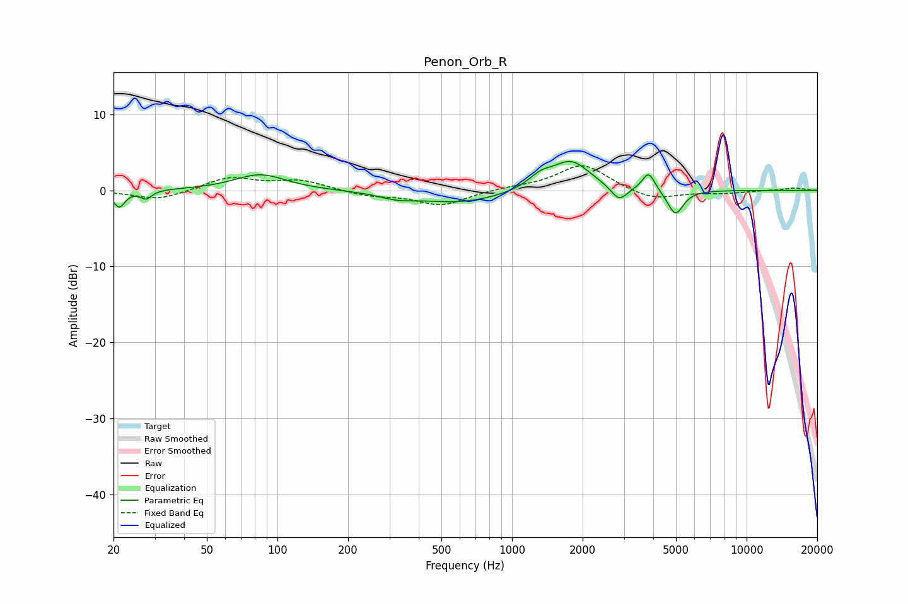

# Penon_Orb_R
See [usage instructions](https://github.com/jaakkopasanen/AutoEq#usage) for more options and info.

### Parametric EQs
Apply preamp of -3.9 dB when using parametric equalizer.

|   # | Type    |   Fc (Hz) |    Q |   Gain (dB) |
|-----|---------|-----------|------|-------------|
|   1 | Peaking |        21 | 5.96 |        -2.2 |
|   2 | Peaking |        28 | 6    |        -1.1 |
|   3 | Peaking |        84 | 1.29 |         2.1 |
|   4 | Peaking |       324 | 1.95 |        -0.7 |
|   5 | Peaking |       601 | 0.78 |        -1.6 |
|   6 | Peaking |      1323 | 2.66 |         1.5 |
|   7 | Peaking |      1789 | 1.76 |         3.8 |
|   8 | Peaking |      2861 | 4.12 |        -1.9 |
|   9 | Peaking |      3821 | 5.25 |         2.5 |
|  10 | Peaking |      4974 | 4.17 |        -3.3 |

### Fixed Band EQs
When using fixed band (also called graphic) equalizer, apply preamp of **-3.3 dB** (if available) and set gains manually with these parameters.

|   # | Type    |   Fc (Hz) |    Q |   Gain (dB) |
|-----|---------|-----------|------|-------------|
|   1 | Peaking |        31 | 1.41 |        -1.3 |
|   2 | Peaking |        62 | 1.41 |         1.7 |
|   3 | Peaking |       125 | 1.41 |         1.3 |
|   4 | Peaking |       250 | 1.41 |        -0.7 |
|   5 | Peaking |       500 | 1.41 |        -2   |
|   6 | Peaking |      1000 | 1.41 |         0.3 |
|   7 | Peaking |      2000 | 1.41 |         3.5 |
|   8 | Peaking |      4000 | 1.41 |        -1.4 |
|   9 | Peaking |      8000 | 1.41 |        -0.3 |
|  10 | Peaking |     16000 | 1.41 |         0.3 |

### Graphs

