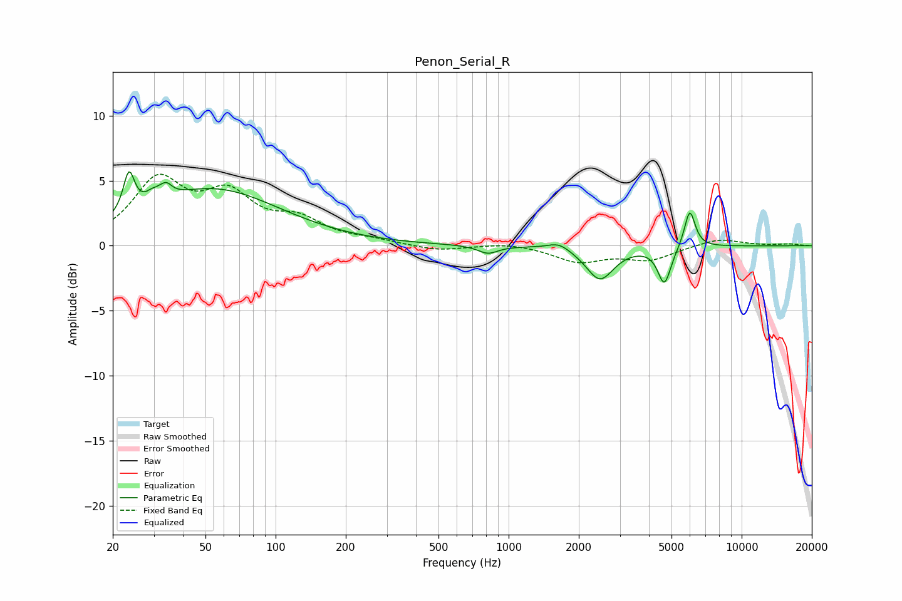

# Penon_Serial_R
See [usage instructions](https://github.com/jaakkopasanen/AutoEq#usage) for more options and info.

### Parametric EQs
Apply preamp of -5.8 dB when using parametric equalizer.

|   # | Type    |   Fc (Hz) |    Q |   Gain (dB) |
|-----|---------|-----------|------|-------------|
|   1 | Peaking |        23 | 6    |         3.1 |
|   2 | Peaking |        30 | 5.28 |         3.2 |
|   3 | Peaking |        30 | 5.91 |        -2.4 |
|   4 | Peaking |        34 | 5.97 |         0.8 |
|   5 | Peaking |        54 | 0.49 |         4.3 |
|   6 | Peaking |       816 | 3.3  |        -0.6 |
|   7 | Peaking |      1643 | 3.06 |         0.5 |
|   8 | Peaking |      2465 | 2.39 |        -2.6 |
|   9 | Peaking |      4661 | 5.02 |        -2.9 |
|  10 | Peaking |      5990 | 6    |         2.9 |

### Fixed Band EQs
When using fixed band (also called graphic) equalizer, apply preamp of **-5.6 dB** (if available) and set gains manually with these parameters.

|   # | Type    |   Fc (Hz) |    Q |   Gain (dB) |
|-----|---------|-----------|------|-------------|
|   1 | Peaking |        31 | 1.41 |         4.8 |
|   2 | Peaking |        62 | 1.41 |         3.4 |
|   3 | Peaking |       125 | 1.41 |         1.7 |
|   4 | Peaking |       250 | 1.41 |         0.3 |
|   5 | Peaking |       500 | 1.41 |        -0.4 |
|   6 | Peaking |      1000 | 1.41 |         0.3 |
|   7 | Peaking |      2000 | 1.41 |        -1.2 |
|   8 | Peaking |      4000 | 1.41 |        -1   |
|   9 | Peaking |      8000 | 1.41 |         0.6 |
|  10 | Peaking |     16000 | 1.41 |         0.1 |

### Graphs

