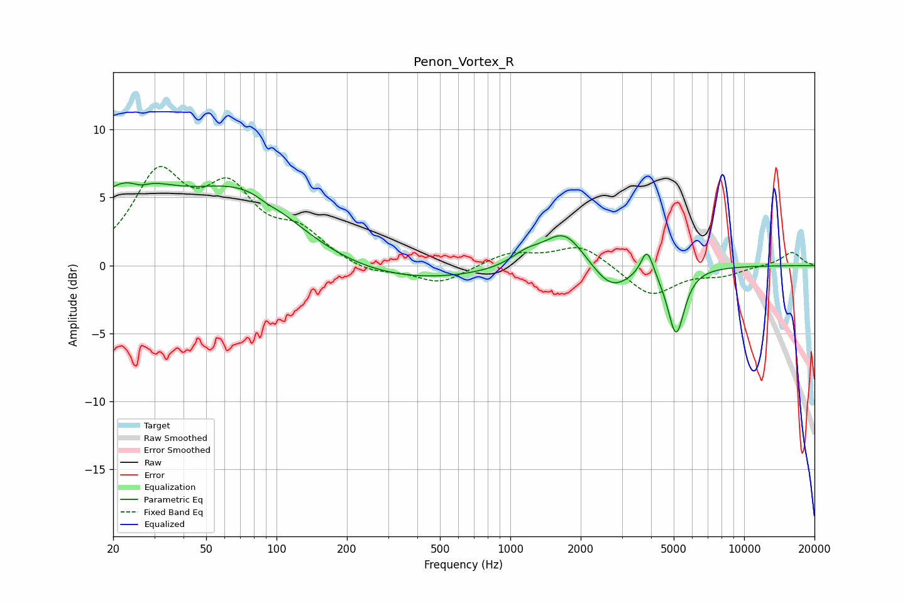

# Penon_Vortex_R
See [usage instructions](https://github.com/jaakkopasanen/AutoEq#usage) for more options and info.

### Parametric EQs
Apply preamp of -6.2 dB when using parametric equalizer.

|   # | Type    |   Fc (Hz) |    Q |   Gain (dB) |
|-----|---------|-----------|------|-------------|
|   1 | Peaking |        23 | 0.76 |         5   |
|   2 | Peaking |        26 | 3.63 |        -0.5 |
|   3 | Peaking |        73 | 0.55 |         6.1 |
|   4 | Peaking |        92 | 3.88 |        -0.2 |
|   5 | Peaking |       182 | 0.25 |        -1.8 |
|   6 | Peaking |      1168 | 2.09 |         0.8 |
|   7 | Peaking |      1703 | 1.63 |         2.7 |
|   8 | Peaking |      2701 | 1.72 |        -1.9 |
|   9 | Peaking |      3846 | 5.35 |         2.1 |
|  10 | Peaking |      5118 | 3.9  |        -4.9 |

### Fixed Band EQs
When using fixed band (also called graphic) equalizer, apply preamp of **-7.4 dB** (if available) and set gains manually with these parameters.

|   # | Type    |   Fc (Hz) |    Q |   Gain (dB) |
|-----|---------|-----------|------|-------------|
|   1 | Peaking |        31 | 1.41 |         6.3 |
|   2 | Peaking |        62 | 1.41 |         4.9 |
|   3 | Peaking |       125 | 1.41 |         2.1 |
|   4 | Peaking |       250 | 1.41 |        -0.7 |
|   5 | Peaking |       500 | 1.41 |        -1.3 |
|   6 | Peaking |      1000 | 1.41 |         0.9 |
|   7 | Peaking |      2000 | 1.41 |         1.5 |
|   8 | Peaking |      4000 | 1.41 |        -2.2 |
|   9 | Peaking |      8000 | 1.41 |        -0.6 |
|  10 | Peaking |     16000 | 1.41 |         1   |

### Graphs

