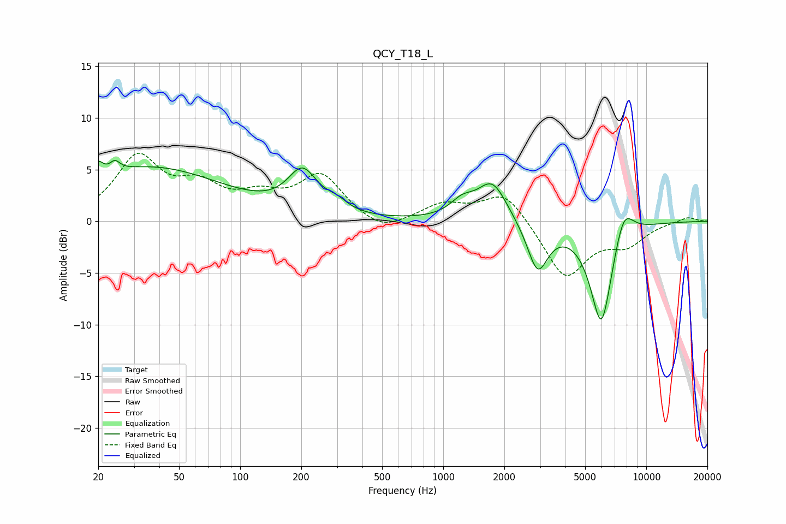

# QCY_T18_L
See [usage instructions](https://github.com/jaakkopasanen/AutoEq#usage) for more options and info.

### Parametric EQs
Apply preamp of -6.0 dB when using parametric equalizer.

|   # | Type    |   Fc (Hz) |    Q |   Gain (dB) |
|-----|---------|-----------|------|-------------|
|   1 | Peaking |        20 | 5.89 |         1.4 |
|   2 | Peaking |        24 | 5.72 |         0.9 |
|   3 | Peaking |        36 | 0.38 |         5.2 |
|   4 | Peaking |       203 | 1.95 |         4   |
|   5 | Peaking |       298 | 2.59 |         0.9 |
|   6 | Peaking |      1240 | 2.36 |         1.4 |
|   7 | Peaking |      1746 | 1.94 |         3.8 |
|   8 | Peaking |      2917 | 2.78 |        -4.8 |
|   9 | Peaking |      6012 | 2.46 |       -10.2 |
|  10 | Peaking |      7726 | 2.75 |         3.3 |

### Fixed Band EQs
When using fixed band (also called graphic) equalizer, apply preamp of **-6.7 dB** (if available) and set gains manually with these parameters.

|   # | Type    |   Fc (Hz) |    Q |   Gain (dB) |
|-----|---------|-----------|------|-------------|
|   1 | Peaking |        31 | 1.41 |         6   |
|   2 | Peaking |        62 | 1.41 |         2.8 |
|   3 | Peaking |       125 | 1.41 |         1.9 |
|   4 | Peaking |       250 | 1.41 |         4.3 |
|   5 | Peaking |       500 | 1.41 |        -1.3 |
|   6 | Peaking |      1000 | 1.41 |         1.6 |
|   7 | Peaking |      2000 | 1.41 |         3   |
|   8 | Peaking |      4000 | 1.41 |        -5.5 |
|   9 | Peaking |      8000 | 1.41 |        -2   |
|  10 | Peaking |     16000 | 1.41 |         0.5 |

### Graphs

