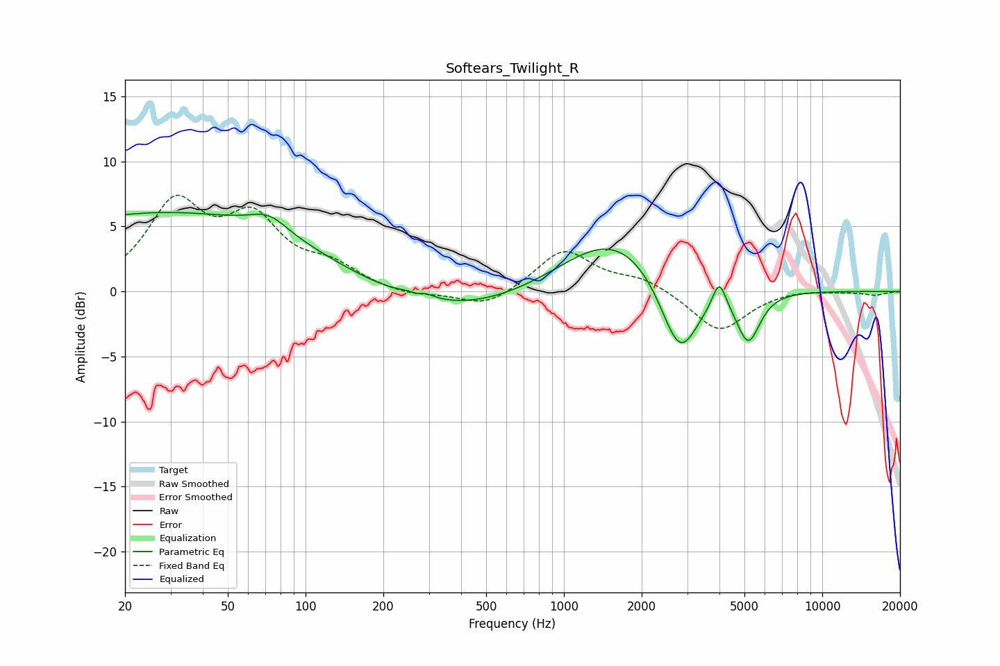

# Softears_Twilight_R
See [usage instructions](https://github.com/jaakkopasanen/AutoEq#usage) for more options and info.

### Parametric EQs
Apply preamp of -6.2 dB when using parametric equalizer.

|   # | Type    |   Fc (Hz) |    Q |   Gain (dB) |
|-----|---------|-----------|------|-------------|
|   1 | Peaking |        22 | 5.64 |        -0   |
|   2 | Peaking |        32 | 0.19 |         6.2 |
|   3 | Peaking |        72 | 1.97 |         1.2 |
|   4 | Peaking |       270 | 5.64 |        -0.6 |
|   5 | Peaking |       274 | 3.38 |         0.9 |
|   6 | Peaking |       276 | 0.36 |        -2.6 |
|   7 | Peaking |      1579 | 0.67 |         4.7 |
|   8 | Peaking |      2807 | 1.85 |        -6.4 |
|   9 | Peaking |      3992 | 5.46 |         2.2 |
|  10 | Peaking |      5174 | 3.05 |        -3.9 |

### Fixed Band EQs
When using fixed band (also called graphic) equalizer, apply preamp of **-7.5 dB** (if available) and set gains manually with these parameters.

|   # | Type    |   Fc (Hz) |    Q |   Gain (dB) |
|-----|---------|-----------|------|-------------|
|   1 | Peaking |        31 | 1.41 |         6.4 |
|   2 | Peaking |        62 | 1.41 |         5   |
|   3 | Peaking |       125 | 1.41 |         1.6 |
|   4 | Peaking |       250 | 1.41 |        -0.4 |
|   5 | Peaking |       500 | 1.41 |        -1.3 |
|   6 | Peaking |      1000 | 1.41 |         3.2 |
|   7 | Peaking |      2000 | 1.41 |         1   |
|   8 | Peaking |      4000 | 1.41 |        -3.1 |
|   9 | Peaking |      8000 | 1.41 |         0.2 |
|  10 | Peaking |     16000 | 1.41 |        -0.3 |

### Graphs

