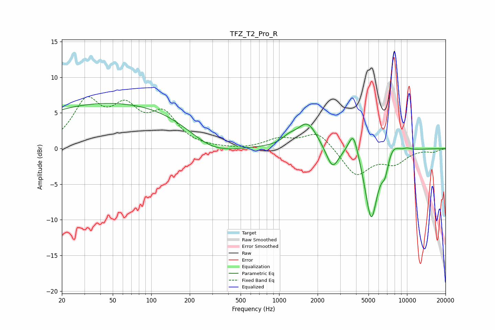

# TFZ_T2_Pro_R
See [usage instructions](https://github.com/jaakkopasanen/AutoEq#usage) for more options and info.

### Parametric EQs
Apply preamp of -6.4 dB when using parametric equalizer.

|   # | Type    |   Fc (Hz) |    Q |   Gain (dB) |
|-----|---------|-----------|------|-------------|
|   1 | Peaking |        53 | 0.18 |         6.5 |
|   2 | Peaking |       296 | 0.71 |        -2.9 |
|   3 | Peaking |      1195 | 2.66 |         0.9 |
|   4 | Peaking |      1663 | 1.82 |         3.6 |
|   5 | Peaking |      2611 | 3    |        -3.1 |
|   6 | Peaking |      3810 | 3.62 |         3.8 |
|   7 | Peaking |      5253 | 2.77 |       -10.1 |
|   8 | Peaking |      6734 | 5.25 |        -2.1 |
|   9 | Peaking |      7741 | 2.76 |         1.5 |
|  10 | Peaking |     10000 | 4.08 |         0.3 |

### Fixed Band EQs
When using fixed band (also called graphic) equalizer, apply preamp of **-7.4 dB** (if available) and set gains manually with these parameters.

|   # | Type    |   Fc (Hz) |    Q |   Gain (dB) |
|-----|---------|-----------|------|-------------|
|   1 | Peaking |        31 | 1.41 |         6.2 |
|   2 | Peaking |        62 | 1.41 |         4.8 |
|   3 | Peaking |       125 | 1.41 |         4.3 |
|   4 | Peaking |       250 | 1.41 |        -0   |
|   5 | Peaking |       500 | 1.41 |        -0.2 |
|   6 | Peaking |      1000 | 1.41 |         1.2 |
|   7 | Peaking |      2000 | 1.41 |         2.4 |
|   8 | Peaking |      4000 | 1.41 |        -3.8 |
|   9 | Peaking |      8000 | 1.41 |        -1.9 |
|  10 | Peaking |     16000 | 1.41 |        -0.4 |

### Graphs

